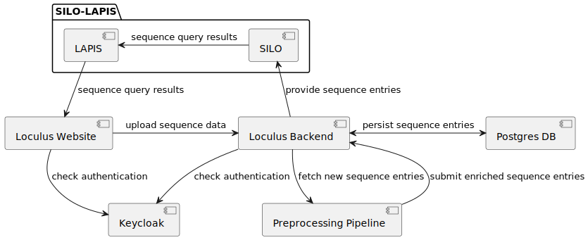

# Loculus

Loculus is a software package to power microbial genomic databases. Major features include:

- Upload and storage of consensus sequences and metadata using a simple web interface or a web API
- Flexible data preprocessing: Loculus comes with a [Nextclade](https://clades.nextstrain.org)-based preprocessing that is able to align and translate sequences but it is also easy to implement and plug-in your own pipeline.
- Powerful searches: Loculus provides a user-friendly interface to search and view sequences as well as an API to query the data using [LAPIS](https://github.com/GenSpectrum/LAPIS) in the backend.
- Highly configurable: The list of metadata fields is fully configurable and Loculus supports both single- and multi-segmented genomes.

Loculus targets any group managing sequencing data. It can be used by small public health or research laboratories with a few members for storing their own, internal data as well as by international databases facilitating global pathogen sequence sharing.

#### [📚 Visit our documentation website](https://loculus.org/)

## Current state and roadmap

The Loculus software is already in a stable stage and used for production systems (see "Known instances" below) and you are welcome to explore this repository and try it out. However, please note that we are planning to revise the configuration files and the APIs before we release the official 1.0. Further, the documentation is so far quite sparse. We plan to release 1.0 with stable APIs and comprehensive documentation in the coming months.

If you are looking for a software to manage sequencing data and would like to know whether Loculus might be a suitable tool for you, please feel free to reach out. We would love to hear about your project and take your needs and requirements into consideration when we plan the further development.

## Known instances

**Pathoplexus** is an initiative to facilitate sharing of genetic sequencing data for human viruses of public health importance. See: https://pathoplexus.org

**GenSpectrum** uses Loculus to store Influenza A, RSV and other viral sequencing data and power its interactive dashboards for analyzing and tracking variants and mutations of viruses. See: https://loculus.genspectrum.org

If you also host a Loculus instance and would like it to be added to this list, please reach out!

## Development

Additional documentation for development is available in each folder's README. This file contains a high-level overview of the project and shared development information that is best kept in one place.

If you would like to develop with a full local loculus instance for development you need to:

1. Deploy a local Kubernetes instance: [Kubernetes](./kubernetes/README.md)
2. Deploy the backend: [backend](./backend/README.md)
3. Deploy the frontend/website: [website](./website/README.md)

Note that if you are developing the backend or frontend/website in isolation a full local loculus instance is not required. See the individual READMEs for more information.

## Architecture

[architecture_docs/](./architecture_docs) contains the architecture documentation of Loculus.

TLDR:

- Backend code is in `backend`, see [`backend/README.md`](/backend/README.md)
- Frontend code is in `website`, see [`website/README.md`](/website/README.md)
- Sequence and metadata processing pipeline is in [`preprocessing`](/preprocessing) folder, see [`preprocessing/specification.md`](/preprocessing/specification.md)
- Deployment code is in `kubernetes`, see [`kubernetes/README.md`](/kubernetes/README.md).
  Check this for local development setup instructions.
- Authentication is performed by our own [Keycloak](https://www.keycloak.org/) instance. See config in [`keycloak-image`](kubernetes/loculus/templates/keycloak-deployment.yaml) and [`realm-config`](kubernetes/loculus/templates/keycloak-config-map.yaml). The keycloak login theme is built with a custom [keycloakify](keycloak/keycloakify) build.

The following diagram shows a rough overview of the involved software components:

## GitHub Actions

While the documentation is still a work in progress, a look at the [`.github/workflows`](/.github/workflows) folder might be helpful:

- [`backend.yml`](/.github/workflows/backend.yml) runs the backend tests and builds the backend docker image
- [`website.yml`](/.github/workflows/website.yml) runs the website tests and builds the website docker image
- [`e2e-k3d.yml`](/.github/workflows/e2e-k3d.yml) runs the end-to-end tests

## Authentication

### User management

We use [Keycloak](https://www.keycloak.org/) for authentication. The Keycloak instance is deployed in the `loculus` namespace and exposed to the outside either under `localhost:8083` or `authentication-[your-argo-cd-path]`. The Keycloak instance is configured with a realm called `loculus` and a client called `backend-client`. The realm is configured to use the exposed URL of Keycloak as a [frontend URL](https://www.keycloak.org/server/hostname).
For testing we added multiple users to the realm. The users are:

- `admin` with password `admin` (login under `your-exposed-keycloak-url/admin/master/console/`)
- `testuser:testuser` (read as username: `testuser`, password `testuser`) and `superuser:superuser` (login under `your-exposed-keycloak-url/realms/loculus/account/`)
- and more testusers, for each browser in the e2e test following the pattern: `testuser_[processId]_[browser]:testuser_[processId]_[browser]`
- These testusers will be added to the `testGroup` in the setup for e2e tests. If you change the number of browsers in the e2e test, you need to adapt `website/tests/playwrightSetup.ts` accordingly.
- To validate that a user exists we also created a technical user for the backend with username `backend` and password `backend`. The technical user is authorized to view users and submitting groups and in principle to manage its own account.

### Group management

- Groups are entities managed by the backend, uniquely identified by a name.
- Every sequence entry is owned by the group that it was initially submitted for. Modifications (edits while awaiting approval, revisions, revocations) can only be made by members of that submitting group.
- Each user can be a member of multiple submitting groups.
- Users can create new submitting groups, becoming the initial member automatically.
- Group members have the authority to add or remove other members.
- Group members have the authority to edit all group metadata (except for group id)
- If the last user leaves a submitting group, the group becomes 'dangling'—it exists but is no longer accessible, and a new group with the same name cannot be created.
- Admin users can manually delete a submitting group directly on the DB but must transfer ownership of sequence entries to another submitting group before doing so to fulfill the foreign key constraint.

For testing we added all users declared above to the group `testGroup`.

## Contributing to Loculus

Contributions are very welcome!
Please see [`CONTRIBUTING.md`](https://github.com/loculus-project/loculus/blob/main/CONTRIBUTING.md)
for more information or ping us in case you need help.
