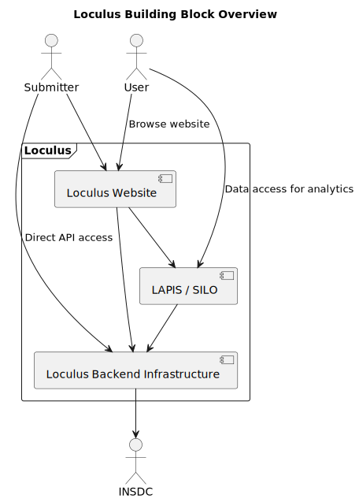
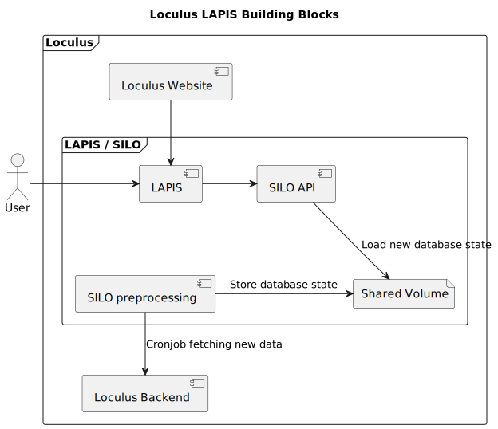

# Building Block View

In the following diagrams, the arrows point from the actor to the system component that is used by the actor.
Data flow may be in the opposite direction
(e.g. in the case of a download: the actor requests a download from the website, the website sends the data to the
actor).

## Overview

This diagram provides a high level overview of the components of Loculus
and how they interact with each other and external participants.

* Users can either
    * use the website to browse the data and download sequences
    * or they can use LAPIS directly to query the data (e.g. for automated analysis).
* Submitters can 
  * submit new sequence data via the website
  * or they can use the API directly to automate their submission process.
* The backend infrastructure stores and processed the data.
* LAPIS / SILO provides the query engine for the sequence data that is stored in the backend infrastructure.
* The backend infrastructure also fetches sequence data from / uploads sequence data to INSDC services.

TODO: Keycloak

## LAPIS / SILO

This diagram shows the components of LAPIS and SILO.

* LAPIS provides an HTTP API to query the sequence data.
  * LAPIS is used by the website, but it can also be used by users directly. 
* The SILO API is a query engine that stores the data in memory to provide fast access.
  LAPIS accesses it via HTTP. 
* The SILO preprocessing fetches data from the Loculus backend in a regular interval,
  processes it into a format that the SILO API can load and stores the result in a shared volume (on disc).
  * The SILO API will pick up the processed data and load it into memory.
