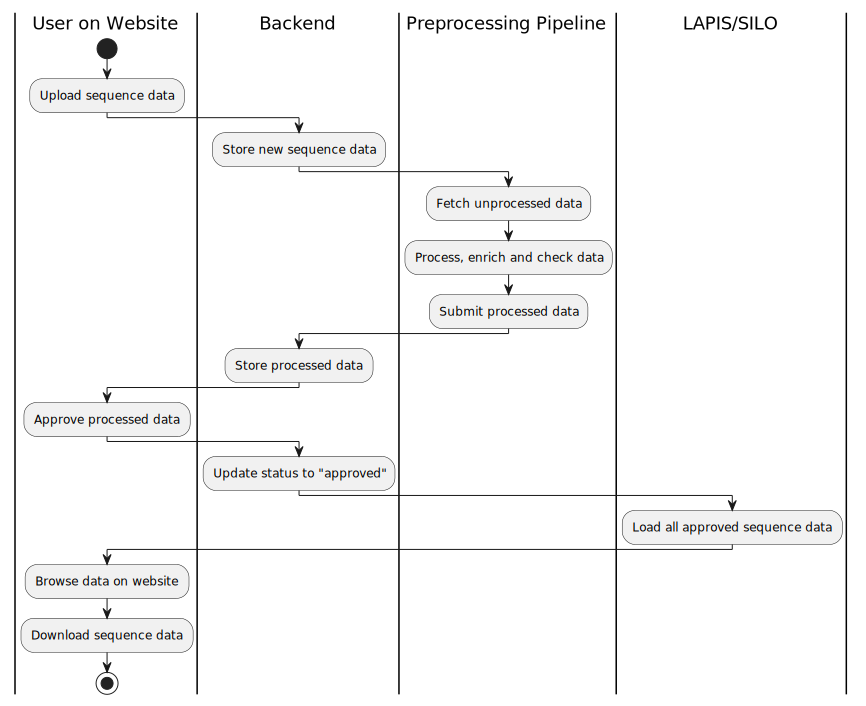

# Runtime view

The following diagram shows a prototypical lifecycle of sequence data in Loculus:
A submitter uploads data on the website, the backend infrastructure processes it
and finally, the data is available for querying via LAPIS.

The [backend runtime view](../backend/docs/runtime_view.md) provides a more detailed view of what happens in the backend
during the submission process.
