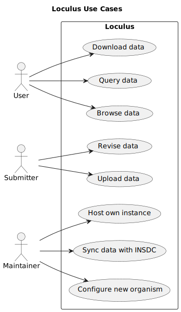

# Introduction And Goals

The top level [README.md](../README.md) already provides a good high-level overview of the project.

Loculus is a software package to power microbial genomial databases.

This is an overview of important use cases:

Users don't need to authenticate (given the Loculus instance is public) to view sequences and metadata.
However, they need to authenticate to upload data (we call those users "submitters").
A user is potentially anyone who is interested in the data, e.g. a researcher, a public health official, or a member of the public.
Submitters will likely be researchers or lab technicians who generate the data.

A maintainer is a person (or group of people) who hosts a Loculus instance.
Depending on the needs, we imagine that Loculus could be used for example in the following scenarios:
* a globally available database (like [Pathoplexus](https://pathoplexus.org/)),
* a database for a research group to share the data that they generate,
* a platform to process and analyse data from INSDC.
