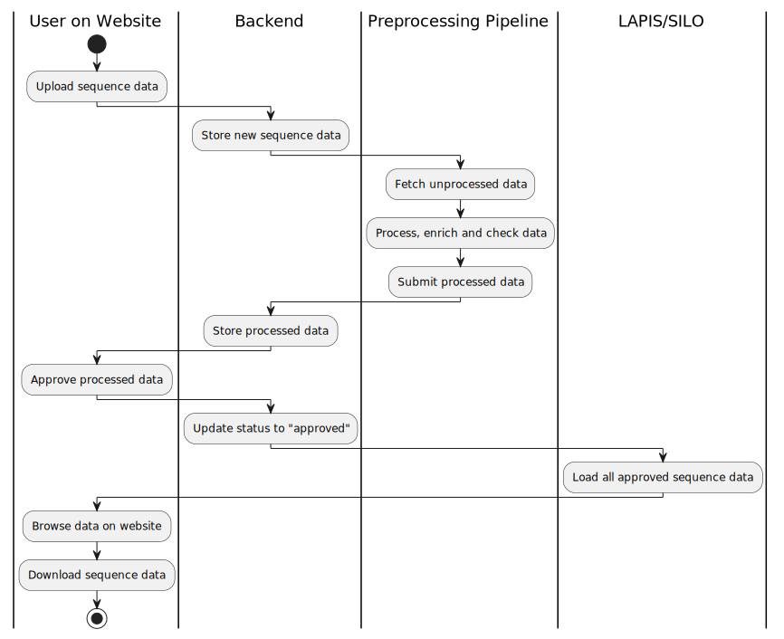
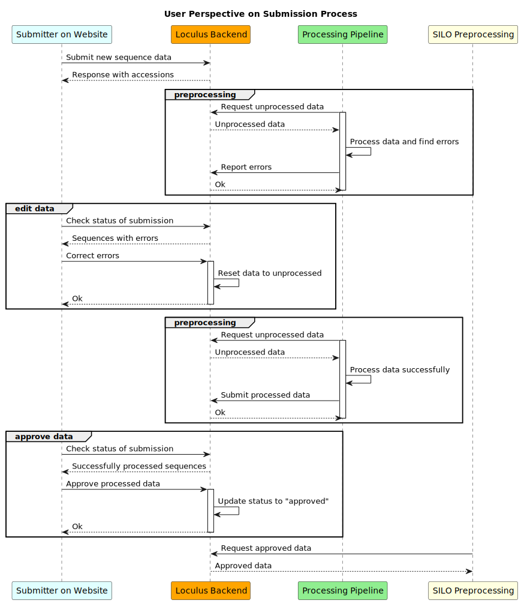
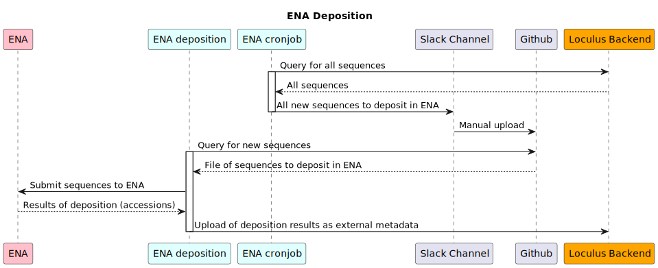

# Runtime view

## Sequence Entry Lifecycle

The following diagram shows a prototypical lifecycle of sequence data in Loculus:
A submitter uploads data on the website, the backend infrastructure processes it
and finally, the data is available for querying via LAPIS.

The [backend runtime view](../backend/docs/runtime_view.md) provides a more detailed view of what happens in the backend
during the submission process.

## Sequence Entry Lifecycle

The next diagram depicts the user interaction when data has been uploaded that is rejected by the preprocessing pipeline in more detail:

Users are asked to edit erroneous data and resubmit it, before they can approve it.
If the data has been reprocessed successfully, they can approve it, and it will be available for querying via LAPIS.

## ENA deposition

The `loculus-get-ena-submission-list-cronjob` calls the `/get-released-data` backend-endpoint and creates a list of all loculus sequences that can be submitted to ENA (for details see [here](https://github.com/loculus-project/loculus/blob/main/ena-submission/README.md)). It then creates a slack notification with this list, after manual review the list can be uploaded to [github.com/pathoplexus/ena-submission](https://github.com/pathoplexus/ena-submission/blob/main/approved/approved_ena_submission_list.json).

The ena-deposition pod queries this github repo for new sequences. Upon finding a new sequence to submit to ENA the pod uploads it to the `ena-deposition` schema in the backend. This triggers the ENA submission process, there are three main steps to this submission: creation of projects, samples and assemblies. If all these steps succeed the ena-deposition pod will upload the results of this submission (e.g. new INSDC accessions) as external metadata to the backend using the `submit-external-metadata` backend-endpoint. The backend only accepts metadata in this request that is in the `externalMetadata` schema. The backend then updates the metadata in the `sequence_entries_view` in the database with the external metadata values - leading to the results being shown on the website.

To avoid re-ingesting the sequences submitted by the ena-deposition pod, ingest also queries the `ena-deposition` schema for the INSDC sample and INSDC assembly accessions of samples Loculus submitted to the INSDC. Sequences with these accessions are filtered out of the data ingested from the INSDC.
