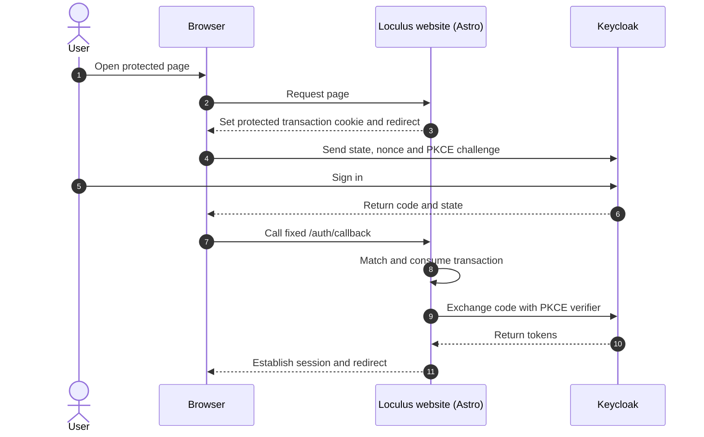
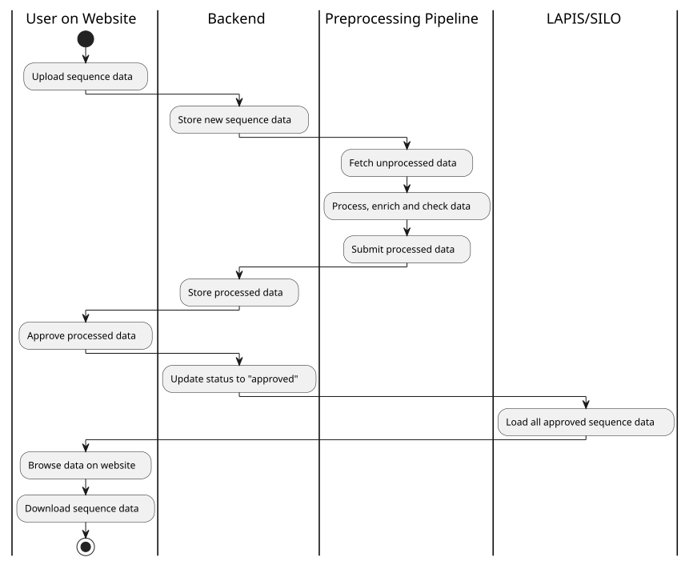
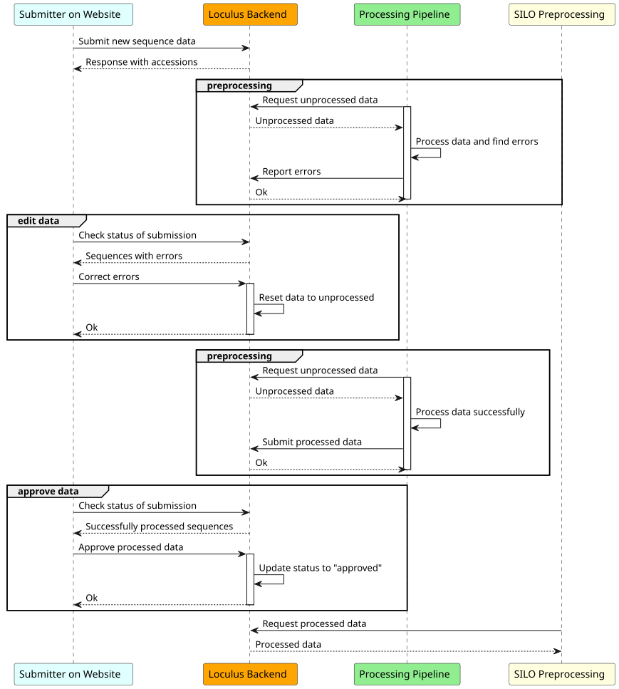
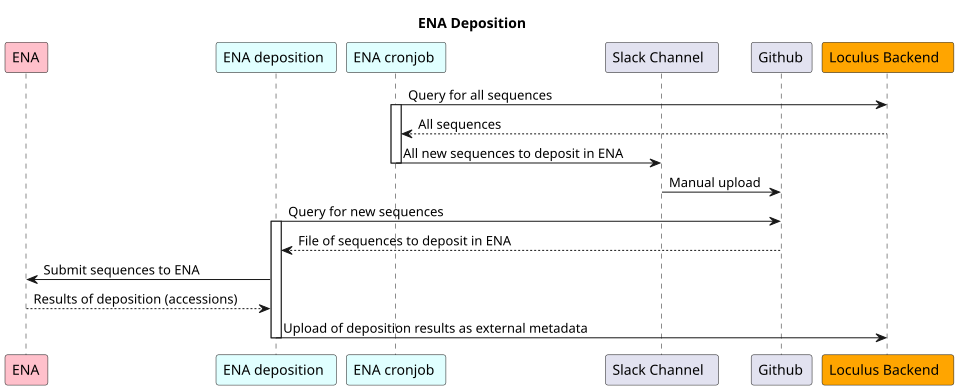

# Runtime view

This shows some selected runtime scenarios.

## Browser Login

The Loculus website initiates browser login and validates the result; the browser does not construct an authentication request or exchange an authorization code itself.

```mermaid
sequenceDiagram
    autonumber
    actor User
    participant Browser
    participant Website as Loculus website (Astro)
    participant Keycloak

    User->>Browser: Open protected page
    Browser->>Website: Request page
    Website-->>Browser: Set protected transaction cookie and redirect
    Browser->>Keycloak: Send state, nonce and PKCE challenge
    User->>Keycloak: Sign in
    Keycloak-->>Browser: Return code and state
    Browser->>Website: Call fixed /auth/callback
    Website->>Website: Match and consume transaction
    Website->>Keycloak: Exchange code with PKCE verifier
    Keycloak-->>Website: Return tokens
    Website-->>Browser: Establish session and redirect
```

The transaction is bound to the initiating browser through an encrypted, HTTP-only cookie. The website validates `state`, `nonce` and PKCE, and permits only a same-origin final destination. See the [browser authentication flow](../docs/src/content/docs/reference/browser-authentication-flow.md) for the protocol details and failure modes.

## Sequence Entry Lifecycle

The following diagram shows a prototypical lifecycle of sequence data in Loculus:
A submitter uploads data on the website, the backend infrastructure processes it
and finally, the data is available for querying via LAPIS.

The [backend runtime view](../backend/docs/runtime_view.md) provides a more detailed view of what happens in the backend
during the submission process.

## Sequence Entry Lifecycle

The next diagram depicts the user interaction when data has been uploaded that is rejected by the preprocessing pipeline in more detail:

Users are asked to edit erroneous data and resubmit it, before they can approve it.
If the data has been reprocessed successfully, they can approve it, and it will be available for querying via LAPIS.

## ENA Deposition

The ENA deposition process is currently tailored for Pathoplexus and not really reusable for other instances yet: 
* The cronjob queries the Loculus backend for all released sequences.
* A file with all new sequences will be sent to a Slack channel.
* A maintainer will review this file and upload it to https://github.com/pathoplexus/ena-submission/.
* The ENA deposition service queries this GitHub repo regularly and submits new sequences to ENA.
* Metadata that is added to the submitted sequences by ENA will then be fetched and submitted to the Loculus backend.

For a more detailed overview, see the [ENA deposition README](../ena-submission/README.md).
