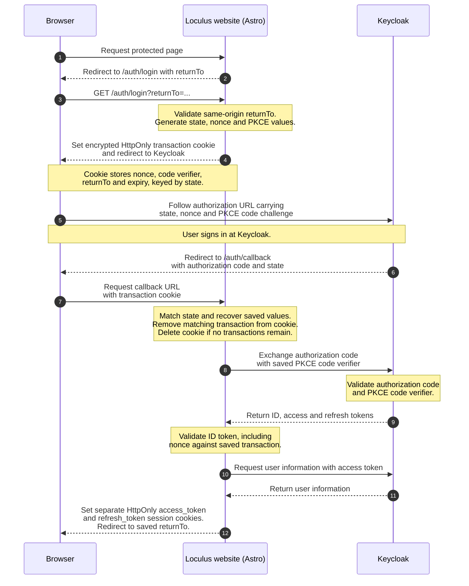

# Runtime view

This shows some selected runtime scenarios.

## Browser Login

The Loculus website's Astro server constructs the OIDC authorization request and validates the login response. The browser carries redirects between Astro and Keycloak; Astro exchanges the authorization code for tokens directly with Keycloak.

```mermaid
sequenceDiagram
    autonumber
    participant Browser
    participant Website as Loculus website (Astro)
    participant Keycloak

    Browser->>Website: Request protected page
    Website-->>Browser: Redirect to /auth/login with returnTo
    Browser->>Website: GET /auth/login?returnTo=...
    Note over Website: Validate same-origin returnTo.<br/>Generate state, nonce and PKCE values.
    Website-->>Browser: Set encrypted HttpOnly transaction cookie<br/>and redirect to Keycloak
    Note over Browser,Website: Cookie stores nonce, code verifier,<br/>returnTo and expiry, keyed by state.
    Browser->>Keycloak: Follow authorization URL carrying<br/>state, nonce and PKCE code challenge
    Note over Browser,Keycloak: User signs in at Keycloak.
    Keycloak-->>Browser: Redirect to /auth/callback<br/>with authorization code and state
    Browser->>Website: Request callback URL<br/>with transaction cookie
    Note over Website: Match state and recover saved values.<br/>Remove matching transaction from cookie.<br/>Delete cookie if no transactions remain.
    Website->>Keycloak: Exchange authorization code<br/>with saved PKCE code verifier
    Note over Keycloak: Validate authorization code<br/>and PKCE code verifier.
    Keycloak-->>Website: Return ID, access and refresh tokens
    Note over Website: Validate ID token, including<br/>nonce against saved transaction.
    Website->>Keycloak: Request user information with access token
    Keycloak-->>Website: Return user information
    Website-->>Browser: Set separate HttpOnly access_token<br/>and refresh_token session cookies.<br/>Redirect to saved returnTo.
```

Astro matches the callback's `state` to the browser's encrypted transaction cookie and validates the ID token, including its `nonce`. Keycloak validates the PKCE code verifier against the code challenge supplied at login initiation. Astro accepts only a same-origin `returnTo` destination.

The transaction cookie tracks pending login attempts; it contains no access or refresh tokens. After successful validation and retrieval of user information, Astro sets separate `access_token` and `refresh_token` cookies through `Set-Cookie` response headers. The browser stores these website session cookies and sends them with subsequent matching requests. They are distinct from Keycloak's own sign-in cookies.

See the [browser authentication flow](../docs/src/content/docs/reference/browser-authentication-flow.md) for definitions, token transport and failure modes, and the [browser authentication upgrade guide](../docs/src/content/docs/reference/upgrade-guides/browser-authentication.md) for existing-deployment rollout and rollback steps.

## Sequence Entry Lifecycle

The following diagram shows a prototypical lifecycle of sequence data in Loculus:
A submitter uploads data on the website, the backend infrastructure processes it
and finally, the data is available for querying via LAPIS.

The [backend runtime view](../backend/docs/runtime_view.md) provides a more detailed view of what happens in the backend
during the submission process.

## Sequence Entry Lifecycle

The next diagram depicts the user interaction when data has been uploaded that is rejected by the preprocessing pipeline in more detail:

Users are asked to edit erroneous data and resubmit it, before they can approve it.
If the data has been reprocessed successfully, they can approve it, and it will be available for querying via LAPIS.

## ENA Deposition

The ENA deposition process is currently tailored for Pathoplexus and not really reusable for other instances yet: 
* The cronjob queries the Loculus backend for all released sequences.
* A file with all new sequences will be sent to a Slack channel.
* A maintainer will review this file and upload it to https://github.com/pathoplexus/ena-submission/.
* The ENA deposition service queries this GitHub repo regularly and submits new sequences to ENA.
* Metadata that is added to the submitted sequences by ENA will then be fetched and submitted to the Loculus backend.

For a more detailed overview, see the [ENA deposition README](../ena-submission/README.md).
