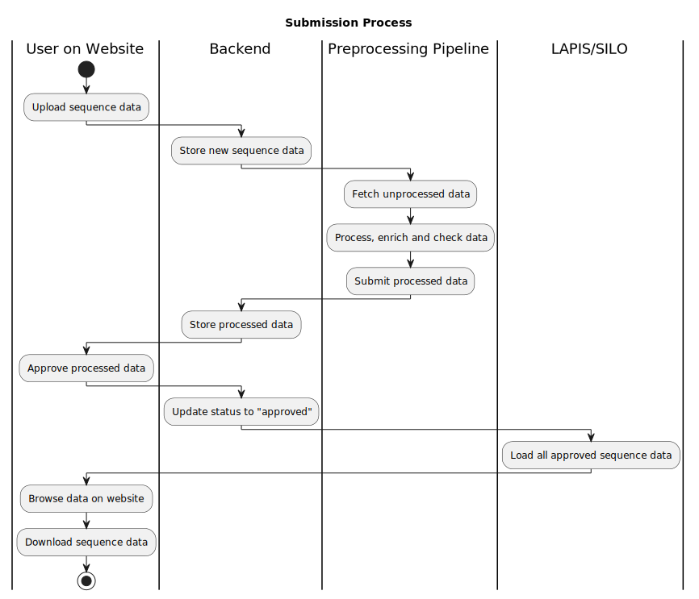

# Runtime view

## Sequence Entry Lifecycle

The following diagram shows a prototypical lifecycle of sequence data in Loculus:
A submitter uploads data on the website, the backend infrastructure processes it
and finally, the data is available for querying via LAPIS.

The [backend runtime view](../backend/docs/runtime_view.md) provides a more detailed view of what happens in the backend
during the submission process.

## Sequence Entry Lifecycle

The next diagram depicts the user interaction when data has been uploaded that is rejected by the preprocessing pipeline in more detail:

Users are asked to edit erroneous data and resubmit it, before they can approve it.
If the data has been reprocessed successfully, they can approve it, and it will be available for querying via LAPIS.

## ENA deposition

TODO: describe this.
