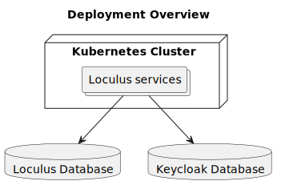
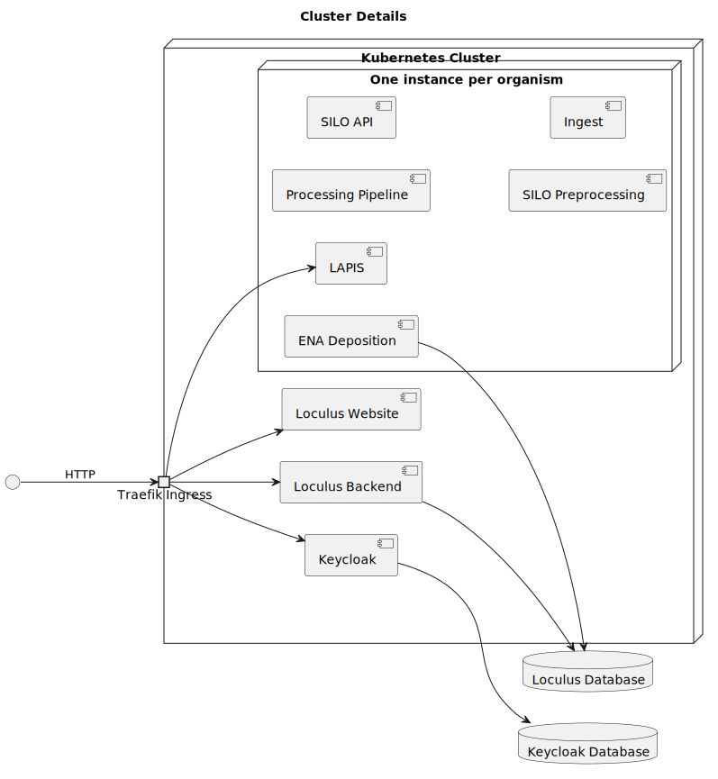

# Deployment View

All artifacts of Loculus are available as Docker images.
Thus, Loculus can be operated in any environment that supports Docker containers.
Due to the extensive configuration processing,
we provide a [Helm](https://helm.sh/) chart that generates and distributes the individual config files from Helm values,
so we suggest to operate Loculus in a Kubernetes cluster and use Helm for deployments.

## High Level Overview

In a productive environment, you will most likely want persistent databases.
We recommend hosting the databases external to your Loculus cluster, as shown in the following diagram:

For local development, we use [k3d](https://k3d.io/) to spin up a local cluster.
There, also the databases are hosted within the cluster, because they don't need to be persistent.

## Cluster Internals

The following diagram sketches the internal structure of the deployed cluster.
Only connections to/from outside the cluster are marked with arrows here.
All other connections are omitted for simplicity.

Inside the cluster, we assume that there is [Traefik](https://traefik.io/) running as an ingress controller.
[k3s](https://k3s.io/) and k3d already come with Traefik installed by default.
We configured Traefik to expose the relevant services to the public:
* the website,
* the backend,
* LAPIS,
* Keycloak.

We only need a single instance of the website, the backend and keycloak (and their respective databases).
The other services (LAPIS, SILO, preprocessing pipeline, ingest and ENA deposition) have to be configured
and deployed per organism that the Loculus instance supports.
We utilize Helm to generate those multiple service instances.
