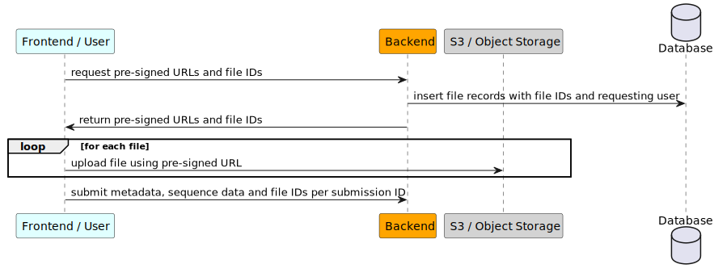
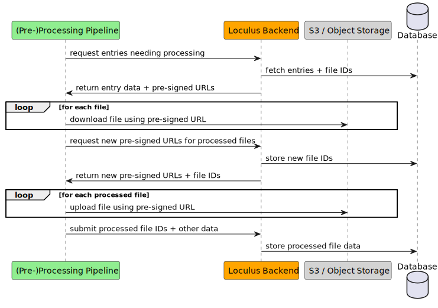

# File sharing

Loculus supports a "file sharing" feature, where arbitrary files can be submitted alongside regular sequence entry data.
The feature uses S3 blob storage to store the actual raw files, and a table (`files`) in the backend to keep track of the files.

Files are not inherently attached to a sequence entry; instead they are first uploaded independently and only attached to a sequence entry later on. Files are owned by a group.

Just like the rest of sequence data files are not publicly accessible until they are released.

Read also the [administrator documentation](https://loculus.org/for-administrators/configuring-extra-files/) on how to configure extra files, as well as set up instructions for the S3.

## Submission

Files are uploaded independently of the normal submission first, and then only the File IDs are attached to the regular submission process. Read the [end user documentation](https://loculus.org/for-users/submit-extra-files/) for details.

## Preprocessing

The preprocessing pipeline gets access to the files as well, when processing sequence entries. Since the files are not yet public, the pipeline receives presigned READ URLs which are valid for a certain amount of time.

The preprocessing pipeline has extra permissions and can also upload new files on behalf of the submitting group.

## Accessing a processed file

To access a processed file, the `/get/{accession}/{version}/{fileCategory}/{fileName}` endpoint can be called. If the sequence entry is released, the file is public and can be accessed without authentication. If the sequence entry is not released, it can only be accessed by authenticated and authorized users.

If the file exists and may be accessed by the user, the endpoint will return a `307 redirect`-response, redirecting a user to a pre-signed URL to receive the file.

## S3 file visibility

By default, the files on S3 are private. When a sequence entry is released, the associated files are made public in S3 as well. The bucket is configured to allow public access for objects which are tagged with `public=true`,
so to make a file public, the backend sets this tag on the object in S3.

### Releasing and pipeline upgrades

There are currently two mechanisms to handle files of new pipeline versions:

- When files are uploaded for entries that are already public, the files are [published right away](https://github.com/loculus-project/loculus/pull/4515).
- When files are uploaded for entries that are not yet published, but are also uploaded with a pipeline version greater than the current one, the backend will [_also_ publish these already](https://github.com/loculus-project/loculus/pull/4581). This is to prevent the files from being private once the current pipeline version is bumped. Why not publish these files during the pipeline version bump? The database is not locked during the bump, and so a file that is uploaded with the n+1 pipeline version could be missed.

## The files table

The database has a table to keep track of the files.

Entries in this table are created by the backend when the `request-uploads` endpoint is called.
The request records who made the request, for which group and when.
Note that the file does not yet exist in S3, the user still needs to upload it.

When a file ID is first submitted together with a sequence entry, the backend checks the file size and sets the `size` field; this is then also the marker used to ensure that a file has actually been uploaded (otherwise the column is `null`).

This table can also be used to find "orphaned" files, i.e. files that have been requested and uploaded,
but haven't been referenced in any sequence submission.
