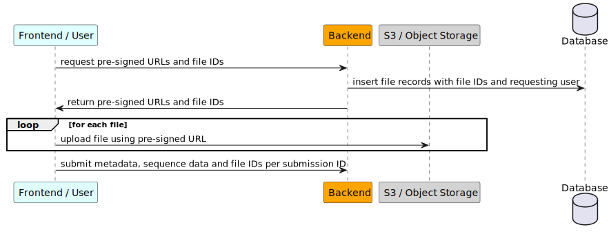
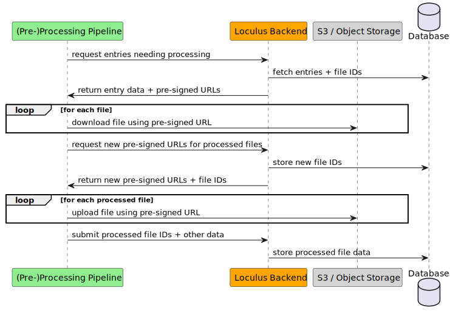

# File sharing

Loculus supports a "file sharing" feature, where arbitrary files can be submitted alongside regular sequence entry data.
The feature uses S3 blob storage to store the actual raw files, and a table in the backend to keep track of the files.

Just like the rest of sequence data files are not publicly accessible until they are released.

## Submission

## Preprocessing

## Releasing

To release a file (i.e. make it public), the file only needs to be tagged with `public=true`.
The bucket is configured to allow public access for files which are tagged like this.
