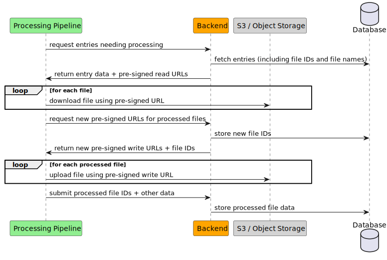

# File sharing

Loculus supports a "file sharing" feature, where arbitrary files can be submitted alongside regular sequence entry data.
The feature uses S3 blob storage to store the actual raw files, and a table in the backend to keep track of the files.

Just like the rest of sequence data files are not publicly accessible until they are released.

## Submission


## Preprocessing



## Releasing

When a sequence entry is released, the associated files are made public as well.
This is done by setting a `released_at` timestamp in the `files` table, and making the file object in S3 public.
The bucket is configured to allow public access for objects which are tagged with `public=true`,
so to make a file public, the backend sets this tag on the object in S3.

## The files table

The database has a table to keep track of the files:

```
CREATE TABLE public.files (
    id uuid NOT NULL,
    upload_requested_at timestamp without time zone NOT NULL,
    uploader text NOT NULL,
    group_id integer NOT NULL,
    released_at timestamp without time zone
);
```

Entries in this table are created by the backend when the `request-uploads` endpoint is called.
The request records who made the request, for which group and when.
Note that the file does not yet exist in S3, the user still needs to upload it.

On release, the release time is also marked in the database.

This table can also be used to find "orphaned" files, i.e. files that have been requested and uploaded,
but haven't been referenced in any sequence submission.
