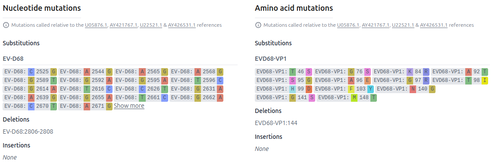

# Solution Design - Multi-Pathogen Organisms

The purpose of this feature to enable Organisms that are divided into several "suborganisms".
It should roughly work as follows:
* The user uploads sequences as usual
* The preprocessing pipeline will figure out which suborganism the sequence belongs to
* There will be a LAPIS instance for that organism that has a nucleotide segment for each suborganism

## Helm Chart Configuration

TODO: how do we make an organism multi-pathogen?

## Submission

Metadata: as usual, nothing special here. (To be confirmed, is that true?)

Sequences: We don't want the user to be forced to put the segment name here.

```
>key1
ACTG
```

For multiple segments:

```
>key1_segment1
ACTG
>key1_segment2
GTCA
```

TODO: Is the `fileMapping` relevant here?

### INSDC Ingest

No changes here.

## Storage of unprocessed sequences

```json
{
    "submissionId": "key1",
    "accession": "PP_0EYHTR4",
    "version": 1,
    "original_data": {
        "metadata": {...},
        "unalignedNucleotideSequences": {
            "main": "ACTG"
        }
    }
}
```

Multi-segments:

```json
{
    "submissionId": "key1",
    "accession": "PP_0EYHTR4",
    "version": 1,
    "original_data": {
        "metadata": {...},
        "unalignedNucleotideSequences": {
            "segment1": "ACTG",
            "segment2": "GTCA"
        }
    }
}
```

## preprocessing input

Similar to what is stored in the DB.

## Preprocessing

TODO: Minimizer index, etc?

## Preprocessing output

```json
{
  "accession": "key1",
  "version": 1,
  "data": {
    "metadata": {...},
    "unalignedNucleotideSequences": {
      "matchingSuborganism": "ACTG",
      // omit the non-matching suborganisms
    },
    "alignedNucleotideSequences": {
      "matchingSuborganism": "ACTG"
    },
    "nucleotideInsertions": {
      "matchingSuborganism": [...],
    },
    "alignedAminoAcidSequences": {
      "matchingSuborganism_gene1": "NRNR*",
      "matchingSuborganism_gene2": "MRGTNF*"
    },
    "aminoAcidInsertions": {
      "matchingSuborganism_gene1": [...],
      "matchingSuborganism_gene2": [...]
    },
    "files": {
      "raw_reads": [
        // anything relevant here?
      ],
      "sequencing_logs": []
    }
  },
  "errors": [...],
  "warnings": [...]
}
```

similar for multiple segments.

## LAPIS / SILO

Will there be per-segment metadata?

The reference genome will be a product "suborganism x segment":

```json
{
  "nucleotideSequences": [
    {"name": "suborganism1", "sequence": "..."},
    {"name": "suborganism2", "sequence": "..."}
  ],
  "genes": [
    {"name": "suborganism1_gene1", "sequence": "..."},
    {"name": "suborganism1_gene2", "sequence": "..."},
    {"name": "suborganism2_gene1", "sequence": "..."},
    {"name": "suborganism2_gene2", "sequence": "..."}
  ]
}
```

for multi-segment:

```json
{
  "nucleotideSequences": [
    {"name": "suborganism1_segment1", "sequence": "..."},
    {"name": "suborganism1_segment2", "sequence": "..."},
    {"name": "suborganism2_segment1", "sequence": "..."},
    {"name": "suborganism2_segment2", "sequence": "..."}
  ],
  "genes": [
    {"name": "suborganism1_gene1", "sequence": "..."},
    {"name": "suborganism1_gene2", "sequence": "..."},
    {"name": "suborganism2_gene1", "sequence": "..."},
    {"name": "suborganism2_gene2", "sequence": "..."}
  ]
}
```

## Website

### Sequence entry details page

Don't show sequences that are not there anyway.
Only show the "segments" of the relevant suborganism.
Only show the relevant genes.
Strip the suborganism name for the sequence names.


Only show the reference of the relevant suborganism in the mutations header:


Mutations should not show the suborganism name:



TODO: Is there more?

### Search Page

Mutation and lineage search should only show up once the search has been narrowed down to a specific suborganism.

Mutation filter: Also strip the suborganism name for the user?
User inputs `A123T`, we send `suborganism1:A123T` to LAPIS.
(Similar for amino acid mutations).

Do we still show the segments in the download modal?


### Review Page

Do we want to leave all those sequences here?


Do we need to change this on the edit page?


## ENA Deposition

TODO: What needs to be done here?
