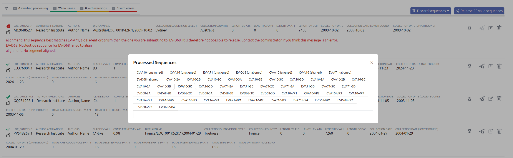

# Solution Design - Multi-Pathogen Organisms

The purpose of this feature to enable Organisms that are divided into several "suborganisms".
It should roughly work as follows:
* The user uploads sequences as usual
* The preprocessing pipeline will figure out which suborganism the sequence belongs to
* There will be a LAPIS instance for that organism that has a nucleotide segment for each suborganism

## Helm Chart Configuration

TODO: how do we make an organism multi-pathogen?

```yaml
defaultOrganisms:
  evs:
    <<: *defaultOrganismConfig
    schema:
      <<: *schema
      organismName: "Enterovirus"
      nucleotideSequences: [CV-A16, CV-A10, EV-A71, EV-D68] # TODO how do we configure those?
      image: "/images/organisms/enterovirus.jpg"
      linkOuts:
        # TODO: how to reference the correct sequence here?
        - name: "Nextclade (CV-A16)"
          url: "https://clades.nextstrain.org/?input-fasta={{[unalignedNucleotideSequences:CV-A16+rich|fasta]}}&dataset-name=community/hodcroftlab/enterovirus/enterovirus/linked/CV-A16&dataset-server=https://raw.githubusercontent.com/alejandra-gonzalezsanchez/nextclade_data/multi-pathogen-evs/data_output"
        # ...
      metadataAdd:
        - name: clade_cv_a16
          displayName: Clade CV-A16
          header: "Clade"
          noInput: true
          generateIndex: true
          autocomplete: true
          initiallyVisible: true
          includeInDownloadsByDefault: true
          preprocessing:
            args:
              segment: CV-A16
            inputs: {input: nextclade.clade}
#       more clades... Do we want to make it easier to configure metadata for every suborganism?
        - name: genotype
          displayName: Genotype
          header: "Genotype"
          noInput: true
          generateIndex: true
          autocomplete: true
          ingest: segment # TODO where should this come from instead?
          initiallyVisible: true
          # TODO we probably need a way to say that this is the discriminating field for the suborganism
      website:
        <<: *website
        tableColumns: [sampleCollectionDate, ...]
    preprocessing:
      - <<: *preprocessing
        configFile:
          <<: *preprocessingConfigFile
          log_level: DEBUG
#          TODO what do we need here? This is what was used in #4570:
#          nextclade_dataset_name: community/hodcroftlab/enterovirus/enterovirus/linked
#          nextclade_dataset_server: https://raw.githubusercontent.com/alejandra-gonzalezsanchez/nextclade_data/multi-pathogen-evs/data_output
#          minimizer_url: "https://raw.githubusercontent.com/alejandra-gonzalezsanchez/loculus-evs/master/evs_minimizer-index.json"
#          require_nextclade_sort_match: true
#          genes: ["CVA16-VP4", "CVA16-VP2", "CVA16-VP3", "CVA16-VP1", "CVA16-2A", "CVA16-2B", "CVA16-2C", "CVA16-3A", "CVA16-3B", "CVA16-3C", "CVA16-3D", "CVA10-VP4", "CVA10-VP2", "CVA10-VP3", "CVA10-VP1", "CVA10-2A", "CVA10-2B", "CVA10-2C", "CVA10-3A", "CVA10-3B", "CVA10-3C", "CVA10-3D", "EVA71-VP4", "EVA71-VP2", "EVA71-VP3", "EVA71-VP1", "EVA71-2A", "EVA71-2B", "EVA71-2C", "EVA71-3A", "EVA71-3B", "EVA71-3C", "EVA71-3D", "EVD68-VP4", "EVD68-VP2", "EVD68-VP3", "EVD68-VP1", "EVD68-2A", "EVD68-2B", "EVD68-2C", "EVD68-3A", "EVD68-3B", "EVD68-3C", "EVD68-3D"]
    ingest:
      <<: *ingest
      configFile:
        <<: *ingestConfigFile
        taxon_id: 12059 # EVs A (All EVs = 12059)
        #          TODO what do we need here? This is what was used in #4570:
#        segment_identification:
#          method: "minimizer"
#          minimizer_index: "https://raw.githubusercontent.com/alejandra-gonzalezsanchez/loculus-evs/master/evs_minimizer-index.json"
#          minimizer_parser:
#            - segment
#        #  method: "align"
#        #  nextclade_dataset_name: community/hodcroftlab/enterovirus/enterovirus/linked
#        #  nextclade_dataset_server: https://raw.githubusercontent.com/alejandra-gonzalezsanchez/nextclade_data/multi-pathogen-evs/data_output
    enaDeposition:
      configFile:
        #          TODO what do we need here? This is what was used in #4570:
#        taxon_id: 12059 # All EVs A = 138948
#        scientific_name: "Enterovirus"
#        molecule_type: "genomic RNA"
    referenceGenomes:
      CV-A10:
        nucleotideSequences:
          - name: main
            sequence: "..."
            insdcAccessionFull: ...
        genes: [...]
      EV-A71:
        nucleotideSequences:
          - name: main
            sequence: "..."
            insdcAccessionFull: ...
        genes: [...]
      # ...

```

## Submission

Metadata: as usual, nothing special here. (To be confirmed, is that true?)

Sequences: We don't want the user to be forced to put the segment name here.

```
>key1
ACTG
```

For multiple segments:

```
>key1_segment1
ACTG
>key1_segment2
GTCA
```

TODO: Is the `fileMapping` relevant here?

### INSDC Ingest

No changes here.

## Storage of unprocessed sequences

```json
{
    "submissionId": "key1",
    "accession": "PP_0EYHTR4",
    "version": 1,
    "original_data": {
        "metadata": {...},
        "unalignedNucleotideSequences": {
            "main": "ACTG"
        }
    }
}
```

Multi-segments:

```json
{
    "submissionId": "key1",
    "accession": "PP_0EYHTR4",
    "version": 1,
    "original_data": {
        "metadata": {...},
        "unalignedNucleotideSequences": {
            "segment1": "ACTG",
            "segment2": "GTCA"
        }
    }
}
```

## preprocessing input

Similar to what is stored in the DB.

## Preprocessing

TODO: Minimizer index, etc?

## Preprocessing output

```json
{
  "accession": "key1",
  "version": 1,
  "data": {
    "metadata": {...},
    "unalignedNucleotideSequences": {
      "matchingSuborganism": "ACTG",
      // omit the non-matching suborganisms
    },
    "alignedNucleotideSequences": {
      "matchingSuborganism": "ACTG"
    },
    "nucleotideInsertions": {
      "matchingSuborganism": [...],
    },
    "alignedAminoAcidSequences": {
      "matchingSuborganism_gene1": "NRNR*",
      "matchingSuborganism_gene2": "MRGTNF*"
    },
    "aminoAcidInsertions": {
      "matchingSuborganism_gene1": [...],
      "matchingSuborganism_gene2": [...]
    },
    "files": {
      "raw_reads": [
        // anything relevant here?
      ],
      "sequencing_logs": []
    }
  },
  "errors": [...],
  "warnings": [...]
}
```

similar for multiple segments.

## LAPIS / SILO

Will there be per-segment metadata?

The reference genome will be a product "suborganism x segment":

```json
{
  "nucleotideSequences": [
    {"name": "suborganism1", "sequence": "..."},
    {"name": "suborganism2", "sequence": "..."}
  ],
  "genes": [
    {"name": "suborganism1_gene1", "sequence": "..."},
    {"name": "suborganism1_gene2", "sequence": "..."},
    {"name": "suborganism2_gene1", "sequence": "..."},
    {"name": "suborganism2_gene2", "sequence": "..."}
  ]
}
```

for multi-segment:

```json
{
  "nucleotideSequences": [
    {"name": "suborganism1_segment1", "sequence": "..."},
    {"name": "suborganism1_segment2", "sequence": "..."},
    {"name": "suborganism2_segment1", "sequence": "..."},
    {"name": "suborganism2_segment2", "sequence": "..."}
  ],
  "genes": [
    {"name": "suborganism1_gene1", "sequence": "..."},
    {"name": "suborganism1_gene2", "sequence": "..."},
    {"name": "suborganism2_gene1", "sequence": "..."},
    {"name": "suborganism2_gene2", "sequence": "..."}
  ]
}
```

### Virtual LAPIS instances

This is a proposal. We are not yet sure whether it is worth implementing.
We'll note it down to understand how much effort it would be.

Idea: Add a feature to LAPIS that allows us to create "virtual" LAPIS instances for each suborganism inside a running LAPIS instance.
* There would be a normal LAPIS instance for the whole organism (as usual)
* There would be a virtual LAPIS instance for each suborganism to take mapping effort from consumers

#### Input Mapping

The "normal LAPIS" has its usual routes like `/sample/details`.

The virtual instances sit below the actual LAPIS with routes like `/suborganism/sample/details`.
This automatically adds the SILO filter `<organism>=suborganism` to all requests.
The field `<organism>` that is affected by the organism name in the request path should be configurable.

Mutations are mapped in incoming requests:
`/suborganism/sample/details?nucleotideMutations=ins_A123T&aminoAcidMutations=ins_gene1:501G`
will send the filter
```json
{
  "nucleotideMutations": "ins_suborganism:A123T",
  "aminoAcidMutations": "ins_suborganism_gene1:501G"
}
```
to SILO.

Similarly, insertions are mapped:
`?nucleotideInsertions=123:AAA&aminoAcidInsertions=gene1:501:AAA`
will send the filter
```json
{
  "nucleotideInsertions": "suborganism:123:AAA",
  "aminoAcidInsertions": "suborganism_gene1:501:AAA"
}
```
to SILO.

The same mappings need to be applied to advanced queries.

Sequence names in the sequence endpoints need to be mapped:
`/suborganism/sample/aminoAcidSequences/gene1`
will send `sequenceNames = ["suborganism_gene1"]` to SILO in the corresponding action.

#### Output Mapping

The response of sequence endpoints needs to be mapped.
* The default FASTA response of single sequence endpoints does not need to be changed.
  The FASTA header does not contain the suborganism name.
* The segment/gene names in the fasta header templates (https://github.com/GenSpectrum/LAPIS/pull/1258) need to be mapped similarly.
* If the organism is single-segmented, the virtual LAPIS instances need to have the single-segmented version of the nucleotide sequence endpoints.
  * i.e. `/suborganism/sample/nucleotideSequences` instead of `/suborganism/sample/nucleotideSequences/{segment}`
  * The base LAPIS instance will have the multisegmented version.
* In JSON and NDJSON sequence responses, the suborganism name needs to be stripped from the sequence names.
  For example, if the LAPIS response contains:
  ```json
  {
    "accession": "...",
    "suborganism1_gene1": "ACTG",
    "suborganism1_gene2": "GTCA"
  }
  ```
  it should be mapped to:
  ```json
  {
    "accession": "...",
    "gene1": "ACTG",
    "gene2": "GTCA"
  }
  ```
* The response of mutation endpoints needs to be mapped similarly.
  For example, if the LAPIS response contains:
  ```json
  {
    "sequenceName": "suborganism1_gene1",
    "mutation": "C21T",
    "count": 99640,
    "coverage": 841669,
    "proportion": 0.11838383022304493,
    "mutationFrom": "C",
    "mutationTo": "T",
    "position": 21
  }
  ```
  it should be mapped to:
  ```json
  {
    "sequenceName": "gene1",
    ...
  }
  ```
  For single segmented organisms, for nucleotide mutations:
    ```json
    {
        "sequenceName": "suborganism1",
        ...
    }
    ```
  should be mapped to:
    ```json
    {
        "sequenceName": null,
        ...
    }
    ```
* The same logic must be applied to insertions:
  ```json
  {
    "insertion": "ins_suborganism:11344:AAGAAG",
    "count": 1,
    "insertedSymbols": "AAGAAG",
    "position": 11344,
    "sequenceName": "suborganism"
  }
  ```
  to
    ```json
    {
        "insertion": "ins:11344:AAGAAG",
        "count": 1,
        "insertedSymbols": "AAGAAG",
        "position": 11344,
        "sequenceName": null
    }
    ```

#### Usage

The Loculus website needs to pick the correct virtual LAPIS based on the filters,
once they have been narrowed down to a specific suborganism.
In return, it would not need to map sequence names in mutations and insertions by itself.

## Website

### Sequence entry details page

Don't show sequences that are not there anyway.
Only show the "segments" of the relevant suborganism.
Only show the relevant genes.
Strip the suborganism name for the sequence names.


Only show the reference of the relevant suborganism in the mutations header:


Mutations should not show the suborganism name:


TODO: Is there more?

### Search Page

Mutation and lineage search should only show up once the search has been narrowed down to a specific suborganism.

Mutation filter: Also strip the suborganism name for the user?
User inputs `A123T`, we send `suborganism1:A123T` to LAPIS.
(Similar for amino acid mutations and insertions).

Do we still show the segments in the download modal?


### Review Page

Do we want to leave all those sequences here?


Do we need to change this on the edit page?


## ENA Deposition

TODO: What needs to be done here?
