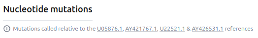

# Solution Design - Multi-Pathogen Organisms

The purpose of this feature to enable Organisms that are divided into several "suborganisms".
It should roughly work as follows:
* The user uploads sequences as usual
* The preprocessing pipeline will figure out which suborganism the sequence belongs to
* There will be a LAPIS instance for that organism that has a nucleotide segment for each suborganism

## Helm Chart Configuration

TODO: how do we make an organism multi-pathogen?

```yaml
defaultOrganisms:
  evs:
    <<: *defaultOrganismConfig
    schema:
      <<: *schema
      organismName: "Enterovirus"
      nucleotideSequences: [CV-A16, CV-A10, EV-A71, EV-D68] # TODO how do we configure those?
      image: "/images/organisms/enterovirus.jpg"
      linkOuts:
        # TODO: how to reference the correct sequence here?
        - name: "Nextclade (CV-A16)"
          url: "https://clades.nextstrain.org/?input-fasta={{[unalignedNucleotideSequences:CV-A16+rich|fasta]}}&dataset-name=community/hodcroftlab/enterovirus/enterovirus/linked/CV-A16&dataset-server=https://raw.githubusercontent.com/alejandra-gonzalezsanchez/nextclade_data/multi-pathogen-evs/data_output"
        # ...
      metadataAdd:
        - name: clade_cv_a16
          displayName: Clade CV-A16
          header: "Clade"
          noInput: true
          generateIndex: true
          autocomplete: true
          initiallyVisible: true
          includeInDownloadsByDefault: true
          preprocessing:
            args:
              segment: CV-A16
            inputs: {input: nextclade.clade}
#       more clades... Do we want to make it easier to configure metadata for every suborganism?
        - name: genotype
          displayName: Genotype
          header: "Genotype"
          noInput: true
          generateIndex: true
          autocomplete: true
          ingest: segment # TODO where should this come from instead?
          initiallyVisible: true
          # TODO we probably need a way to say that this is the discriminating field for the suborganism
      website:
        <<: *website
        tableColumns: [sampleCollectionDate, ...]
    preprocessing:
      - <<: *preprocessing
        configFile:
          <<: *preprocessingConfigFile
          log_level: DEBUG
          minimizer_url: ...
          assign_subtype_with_minimizer: true
          referenceGenomes:
            CV-A10:
              nucleotideSequences:
                - name: main
                  nextclade_dataset_name: ...
                  nextclade_dataset_server: ...
                  accepted_minimizer_matches_list: [...]
              genes:
                - name: VP4
                - ...
            EV-A71:
              nucleotideSequences: [...]
              genes: [..]
    ingest:
      <<: *ingest
      configFile:
        <<: *ingestConfigFile
        taxon_id: 12059 # EVs A (All EVs = 12059)
        #          TODO what do we need here? This is what was used in #4570:
#        segment_identification:
#          method: "minimizer"
#          minimizer_index: "https://raw.githubusercontent.com/alejandra-gonzalezsanchez/loculus-evs/master/evs_minimizer-index.json"
#          minimizer_parser:
#            - segment
#        #  method: "align"
#        #  nextclade_dataset_name: community/hodcroftlab/enterovirus/enterovirus/linked
#        #  nextclade_dataset_server: https://raw.githubusercontent.com/alejandra-gonzalezsanchez/nextclade_data/multi-pathogen-evs/data_output
    enaDeposition:
      configFile:
        #          TODO what do we need here? This is what was used in #4570:
#        taxon_id: 12059 # All EVs A = 138948
#        scientific_name: "Enterovirus"
#        molecule_type: "genomic RNA"
    referenceGenomes:
      CV-A10:
        nucleotideSequences:
          - name: main
            sequence: "..."
            insdcAccessionFull: ...
        genes: 
          - name: VP4
            sequence: "..."
          - ...
      EV-A71:
        nucleotideSequences:
          - name: main
            sequence: "..."
            insdcAccessionFull: ...
        genes:
          - name: VP2
            sequence: "..."
          - ...
      # ...
```

The website will then receive the `referenceGenomes` as configured above.
LAPIS and the backend will receive a "merged" reference genome 
that merges all suborganisms by prepending the suborganism name to the sequence name 
(ignoring `main` if there is only a single segment):
```json
{
  "nucleotideSequences": [
    {"name": "CV-A10", "sequence": "..."},
    {"name": "EV-A71", "sequence": "..."},
    // ...
  ],
  "genes": [
    {"name": "CV-A10-VP4", "sequence": "..."},
    {"name": "EV-A71-VP2", "sequence": "..."},
    // ...
  ]
}
```

Consequence:
* The backend only knows the merged reference genome and will not know about the individual suborganisms.
  It should be relatively agnostic to how the organisms are structured.
  It just needs to make sure that the preprocessing output contains all segments and genes that are required for SILO.
* The reference genomes of the website will be different from reference genome in LAPIS and the backend.
  (In the single pathogen case, they will still be the same.)

## Submission

Metadata: as usual, nothing special here.

Sequences: We don't want the user to be forced to put the segment name here.

```
>key1
ACTG
```

For multiple segments:

```
>key1_myFirstSegment
ACTG
>key1_mySecondSegment
GTCA
```

We will achieve this by removing the requirement to put the segment name in the sequence header.
We will keep `_` as a separator.
Independently of how many segments there are, 
* if there is no `_` in the FASTA header, then the backend will use the full FASTA header for matching in on the metadata (form: `>{id}`).
* if there is a `_` in the FASTA header, then the backend will use the part before the last `_` for matching in on the metadata (form: `>{id}_{arbitrary segment name}`).

TODO: Is the `fileMapping` relevant here?

### INSDC Ingest

No changes here.

## Storage of unprocessed sequences

The backend will use the FASTA header as the key for the unaligned nucleotide sequences.
This affects all organisms, not just multi-pathogen organisms!

```json
{
    "submissionId": "key1",
    "accession": "PP_0EYHTR4",
    "version": 1,
    "original_data": {
        "metadata": {...},
        "unalignedNucleotideSequences": {
            "key1": "ACTG"
        }
    }
}
```

Multiple segments:

```json
{
    "submissionId": "key1",
    "accession": "PP_0EYHTR4",
    "version": 1,
    "original_data": {
        "metadata": {...},
        "unalignedNucleotideSequences": {
            "key1_myFirstSegment": "ACTG",
            "key1_mySecondSegment": "GTCA"
        }
    }
}
```

### Problems that need to be solved:
 
The backend compresses the unaligned nucleotide sequences before storing them.
It uses the reference sequence as dictionary to achieve a good compression ratio.
This is possible because it knows which segment a sequence is supposed to be.

This will not be possible anymore.
For single-segment organisms, the backend can still take the only segment as the dictionary.

When there are multiple segments:
* What should we use as the dictionary? Concatenation of all segments?
* How do we make sure that after rolling out these changes, 
  the unaligned nucleotide sequences that are already in the DB can still be decompressed (e.g. CCHF)?
  This probably requires a non-trivial database migration.
  The reference sequences are not store in the DB, so the migration cannot be a simple SQL script.

## preprocessing input

Similar to what is stored in the DB.

## Preprocessing

The preprocessing pipeline will need to assign each sequence to a segment, if there are multiple segments
(including validation and useful error messages for the submitter).

TODO: details how to do that - minimizer index, etc.?

## Preprocessing output

```json
{
  "accession": "key1",
  "version": 1,
  "data": {
    "metadata": {...},
    "unalignedNucleotideSequences": {
      "matchingSuborganism": "ACTG",
      "other non matching suborganisms...": null
    },
    "alignedNucleotideSequences": {
      "matchingSuborganism": "ACTG"
    },
    "nucleotideInsertions": {
      "matchingSuborganism": [...],
    },
    "alignedAminoAcidSequences": {
      "matchingSuborganism-gene1": "NRNR*",
      "matchingSuborganism-gene2": "MRGTNF*",
      "other non matching suborganisms...-gene": null
    },
    "aminoAcidInsertions": {
      "matchingSuborganism-gene1": [...],
      "matchingSuborganism-gene2": [...]
    },
    "files": {
      "raw_reads": [
        // anything relevant here?
      ],
      "sequencing_logs": []
    }
  },
  "errors": [...],
  "warnings": [...]
}
```

similar for multiple segments.

The backend will validate the preprocessing output against the merged reference genome
since the merged reference genome is used in SILO and the preprocessing result will be fed into SILO.
In particular all segments and genes for all suborganisms must be present in the preprocessing output.

## LAPIS / SILO

Will there be per-segment metadata?

The reference genome will be a product "suborganism x segment":

```json
{
  "nucleotideSequences": [
    {"name": "suborganism1", "sequence": "..."},
    {"name": "suborganism2", "sequence": "..."}
  ],
  "genes": [
    {"name": "suborganism1_gene1", "sequence": "..."},
    {"name": "suborganism1_gene2", "sequence": "..."},
    {"name": "suborganism2_gene1", "sequence": "..."},
    {"name": "suborganism2_gene2", "sequence": "..."}
  ]
}
```

for multi-segment:

```json
{
  "nucleotideSequences": [
    {"name": "suborganism1_segment1", "sequence": "..."},
    {"name": "suborganism1_segment2", "sequence": "..."},
    {"name": "suborganism2_segment1", "sequence": "..."},
    {"name": "suborganism2_segment2", "sequence": "..."}
  ],
  "genes": [
    {"name": "suborganism1_gene1", "sequence": "..."},
    {"name": "suborganism1_gene2", "sequence": "..."},
    {"name": "suborganism2_gene1", "sequence": "..."},
    {"name": "suborganism2_gene2", "sequence": "..."}
  ]
}
```

### Virtual LAPIS instances

This is a proposal. We are not yet sure whether it is worth implementing.
We'll note it down to understand how much effort it would be.

Idea: Add a feature to LAPIS that allows us to create "virtual" LAPIS instances for each suborganism inside a running LAPIS instance.
* There would be a normal LAPIS instance for the whole organism (as usual)
* There would be a virtual LAPIS instance for each suborganism to take mapping effort from consumers

#### Input Mapping

The "normal LAPIS" has its usual routes like `/sample/details`.

The virtual instances sit below the actual LAPIS with routes like `/suborganism/sample/details`.
This automatically adds the SILO filter `<organism>=suborganism` to all requests.
The field `<organism>` that is affected by the organism name in the request path should be configurable.

Mutations are mapped in incoming requests:
`/suborganism/sample/details?nucleotideMutations=ins_A123T&aminoAcidMutations=ins_gene1:501G`
will send the filter
```json
{
  "nucleotideMutations": "ins_suborganism:A123T",
  "aminoAcidMutations": "ins_suborganism_gene1:501G"
}
```
to SILO.

Similarly, insertions are mapped:
`?nucleotideInsertions=123:AAA&aminoAcidInsertions=gene1:501:AAA`
will send the filter
```json
{
  "nucleotideInsertions": "suborganism:123:AAA",
  "aminoAcidInsertions": "suborganism_gene1:501:AAA"
}
```
to SILO.

The same mappings need to be applied to advanced queries.

Sequence names in the sequence endpoints need to be mapped:
`/suborganism/sample/aminoAcidSequences/gene1`
will send `sequenceNames = ["suborganism_gene1"]` to SILO in the corresponding action.

#### Output Mapping

The response of sequence endpoints needs to be mapped.
* The default FASTA response of single sequence endpoints does not need to be changed.
  The FASTA header does not contain the suborganism name.
* The segment/gene names in the fasta header templates (https://github.com/GenSpectrum/LAPIS/pull/1258) need to be mapped similarly.
* If the organism is single-segmented, the virtual LAPIS instances need to have the single-segmented version of the nucleotide sequence endpoints.
  * i.e. `/suborganism/sample/nucleotideSequences` instead of `/suborganism/sample/nucleotideSequences/{segment}`
  * The base LAPIS instance will have the multisegmented version.
* In JSON and NDJSON sequence responses, the suborganism name needs to be stripped from the sequence names.
  For example, if the LAPIS response contains:
  ```json
  {
    "accession": "...",
    "suborganism1_gene1": "ACTG",
    "suborganism1_gene2": "GTCA"
  }
  ```
  it should be mapped to:
  ```json
  {
    "accession": "...",
    "gene1": "ACTG",
    "gene2": "GTCA"
  }
  ```
* The response of mutation endpoints needs to be mapped similarly.
  For example, if the LAPIS response contains:
  ```json
  {
    "sequenceName": "suborganism1_gene1",
    "mutation": "C21T",
    "count": 99640,
    "coverage": 841669,
    "proportion": 0.11838383022304493,
    "mutationFrom": "C",
    "mutationTo": "T",
    "position": 21
  }
  ```
  it should be mapped to:
  ```json
  {
    "sequenceName": "gene1",
    ...
  }
  ```
  For single segmented organisms, for nucleotide mutations:
    ```json
    {
        "sequenceName": "suborganism1",
        ...
    }
    ```
  should be mapped to:
    ```json
    {
        "sequenceName": null,
        ...
    }
    ```
* The same logic must be applied to insertions:
  ```json
  {
    "insertion": "ins_suborganism:11344:AAGAAG",
    "count": 1,
    "insertedSymbols": "AAGAAG",
    "position": 11344,
    "sequenceName": "suborganism"
  }
  ```
  to
    ```json
    {
        "insertion": "ins:11344:AAGAAG",
        "count": 1,
        "insertedSymbols": "AAGAAG",
        "position": 11344,
        "sequenceName": null
    }
    ```

#### Usage

The Loculus website needs to pick the correct virtual LAPIS based on the filters,
once they have been narrowed down to a specific suborganism.
In return, it would not need to map sequence names in mutations and insertions by itself.

## Website

### Sequence entry details page

Don't show sequences that are not there anyway.
Only show the "segments" of the relevant suborganism.
Only show the relevant genes.
Strip the suborganism name for the sequence names.


Only show the reference of the relevant suborganism in the mutations header:



Mutations should not show the suborganism name:


TODO: Is there more?

### Search Page

Mutation and lineage search should only show up once the search has been narrowed down to a specific suborganism.

Mutation filter: Also strip the suborganism name for the user?
User inputs `A123T`, we send `suborganism1:A123T` to LAPIS.
(Similar for amino acid mutations and insertions).

Do we still show the segments in the download modal?


### Review Page

Do we want to leave all those sequences here?


Do we need to change this on the edit page?
Those are unprocessed sequences.
When there backend doesn't know the segments anymore, what do we display here?


## ENA Deposition

TODO: What needs to be done here?
