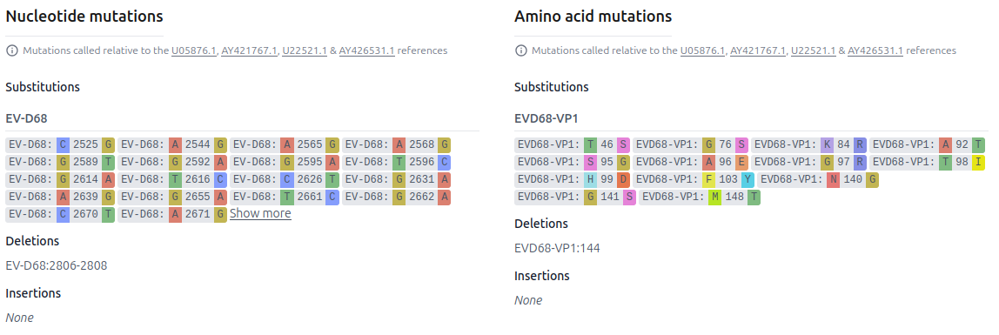
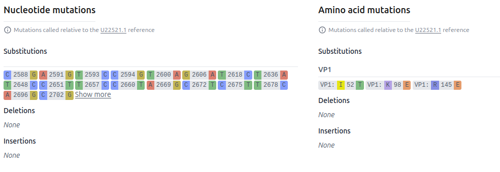
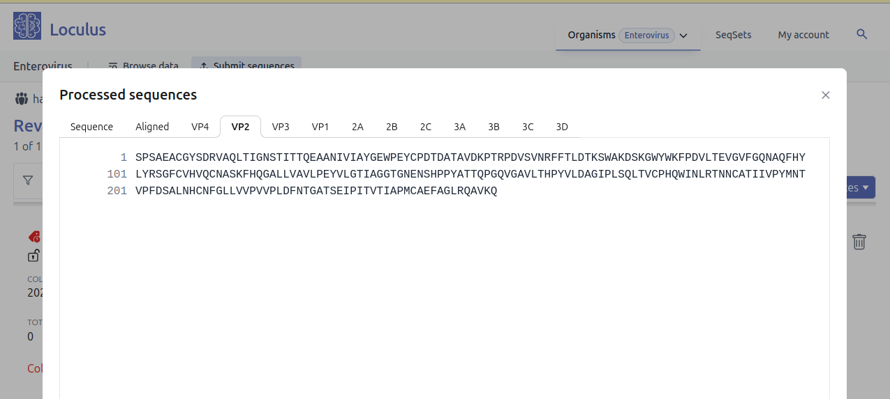

# Solution Design - Organisms With Multiple References ("Subtypes")

The purpose of this feature is to allow a single top level organism to contain multiple references, or multiple "suborganisms".

Motivation:

- The current organism-based architecture does not scale effectively for virus species that have only a small number of sequences per organism.
  each organism requires separate pods for LAPIS/SILO, ingest and preprocessing.
- It's inconvenient for submitters to have to split their uploads by suborganism, 
  just because the sequences map to different references
- Much of the flexibility at the organism level isn't actually used in practice, causing configuration overhead
- Data from different suborganisms cannot be viewed or downloaded together.

The "multi-pathogen" feature should roughly work as follows:

* User uploads sequences without having to explicitly specify the suborganism (or segment) in the sequence header
* Preprocessing pipeline will figure out which suborganism (and segment) each sequence belongs to
* For LAPIS and the backend, each suborganism is treated as an additional segment.
  As LAPIS instances only support one organism,
  we configure LAPIS on the organism level and treat each suborganism as a segment with its own reference.
* The website will try to create an immersive experience for each suborganism: 
  * Mutation and lineage searches are available only after a specific suborganism is selected.
  * Only segments and genes relevant to the selected suborganism are displayed.
  * Sequence names in the UI omit the suborganism name.

The issue [#3984](https://github.com/loculus-project/loculus/issues/3984) contains links to implementation steps.

## Helm Chart Configuration

This sketches the relevant parts of the organism configuration for an organism with suborganisms.

```yaml
defaultOrganisms:
  evs:
    <<: *defaultOrganismConfig
    schema:
      <<: *schema
      organismName: "Enterovirus"
      metadataAdd:
        - name: clade_cv_a10
          # tells the website to only show this field on the search page when CV-A10 is selected
          onlyForReference: CV-A10 
          preprocessing:
            args:
              #calculate this field from the results of the nextclade dataset for segment main and reference CV-A10
              segment: main
              reference: CV-A10
            inputs: {input: nextclade.clade}
        - name: completeness
          type: float
          noInput: true
          # preprocessing will automatically take the first available segment value for "perSegment" fields
          perSegment: true
          rangeSearch: true
          preprocessing:
            inputs: {input: nextclade.coverage}
        # There must be a "discriminator field" that tells which suborganism a sequence belongs to
        - name: genotype
          displayName: Genotype
          header: "Genotype"
          noInput: true
          preprocessing:
            inputs: {input: ASSIGNED_REFERENCE}
          perSegment: true
      website:
        <<: *website
        # When the website needs to know which suborganism a sequence entry belongs to (i.e. which reference it aligns to),
        # it will look up the value of this metadata field (this metadata field will exist for each segment, e.g. genotype_L, genotype_M).
        # Preprocessing must make sure that this field is always populated.
        referenceIdentifierField: genotype
    preprocessing:
      - <<: *preprocessing
        configFile:
          <<: *preprocessingConfigFile
          # use a minimizer to figure out which suborganism a submitted sequence belongs to
          segment_classification_method: "minimizer"
          minimizer_url: "https://raw.githubusercontent.com/alejandra-gonzalezsanchez/loculus-evs/master/evs_minimizer-index.json"
          segments:
            - name: main
              references:
              - reference_name: CV-A16
                nextclade_dataset_name: enpen/enterovirus/cv-a16
                accepted_dataset_matches: ["community/hodcroftlab/enterovirus/cva16", "community/hodcroftlab/enterovirus/enterovirus/linked/CV-A16"]
                genes: ["VP4", "VP2", "VP3", "VP1", "2A", "2B", "2C", "3A", "3B", "3C", "3D"]
              - reference_name: CV-A10
                nextclade_dataset_name: enpen/enterovirus/cv-a10
                accepted_dataset_matches: ["community/hodcroftlab/enterovirus/enterovirus/linked/CV-A10"]
                genes: ["VP4", "VP2", "VP3", "VP1", "2A", "2B", "2C", "3A", "3B", "3C", "3D"]
          nextclade_dataset_server: https://raw.githubusercontent.com/nextstrain/nextclade_data/evs-datasets/data_output
    # `referenceGenomes` is now an object { suborganismName: referenceGenomeOfThatSuborganism }
    # The special suborganism name `singleReference` must be used when there is only a single suborganism
    referenceGenomes:
      - name: main
        references:
          - reference_name: CV-A10
            sequence: "..."
            insdcAccessionFull: ...
            genes: 
              - name: VP4
                sequence: "..."
          - reference_name: EV-A71
            sequence: "..."
            insdcAccessionFull: ...
            genes:
              - name: VP2
                sequence: "..."
```

The website will then receive the `referenceGenomes` as configured above.
LAPIS and the backend will receive a "merged" (flat) reference genome 
that merges all suborganisms by prepending the suborganism name to the sequence name 
(ignoring `main` if there is only a single segment):

```json
{
  "nucleotideSequences": [
    {"name": "CV-A10", "sequence": "..."},
    {"name": "EV-A71", "sequence": "..."},
    // ...
  ],
  "genes": [
    {"name": "CV-A10-VP4", "sequence": "..."},
    {"name": "EV-A71-VP2", "sequence": "..."},
    // ...
  ]
}
```

Consequences:

* The backend only knows the merged reference genome and will not know about the individual suborganisms.
  It should be relatively agnostic to how the organisms are structured.
  It just needs to make sure that the preprocessing output contains all segments and genes that are required for SILO.
* The names of the segments shown on the website will be different from the names of the segments in LAPIS and the backend.
  (In the single pathogen case, they will still be the same.)
* When users query data from the API,
  they will need to prepend the suborganism names in sequence names and mutation names.
* The preprocessing pipeline needs the capability to determine the suborganism of a submitted entry.

## Submission

Metadata is submitted as usual.

When submitting sequences,
we don't want the user to be forced to put the segment (and/or suborganism) name in the FASTA header.
The submission of such a file should be possible (without knowing the suborganism names beforehand):

```fasta
>key1
ACTG
```

For multiple segments:

```fasta
>key1_myFirstSegment
ACTG
>key1_mySecondSegment
GTCA
```

We will achieve this by removing the requirement to put the segment name in the sequence header.
Users can now add a column `fastaIds` to the metadata file to group sequences under one metadata entry.
If not provided, the `submissionId` will be used as the only `fastaId`.
Thus, for single-segmented organisms with several suborganisms the submission works just as for single-pathogen organisms.

See [#5382](https://github.com/loculus-project/loculus/pull/5382) for the implementation.

## Storage of unprocessed sequences

The backend will use the FASTA header as the key for the unaligned nucleotide sequences.
This affects all organisms, not just multi-pathogen organisms!

```json
{
    "submissionId": "key1",
    "accession": "PP_0EYHTR4",
    "version": 1,
    "original_data": {
        "metadata": {...},
        "unalignedNucleotideSequences": {
            "key1": "ACTG"
        }
    }
}
```

Multiple segments:

```json
{
    "submissionId": "key1",
    "accession": "PP_0EYHTR4",
    "version": 1,
    "original_data": {
        "metadata": {...},
        "unalignedNucleotideSequences": {
            "key1_myFirstSegment": "ACTG",
            "key1_mySecondSegment": "GTCA"
        }
    }
}
```

This is also the format that the preprocessing pipeline will receive.
The storage format of processed sequences has not changed.
It will still use the segment/gene names that the preprocessing pipeline assigns.

### Changes to compression

Previously, the backend compressed sequences with zstd using each reference segment as the dictionary.
This was possible for unprocessed sequences because segments were known upfront through the FASTA id.
With the new design, the backend will no longer know which segment (suborganism) a sequence belongs to.

The backend now stores the compression dictionaries for each sequence (processed and unprocessed) in the database.
The dictionaries are populated from the reference genome.
* For unprocessed sequences, it uses the concatenated nucleotide sequences of all segments (and all suborganisms).
* For unprocessed sequences that were already stored before this change,
  there was a migration that assigned the dictionary based on which segment the sequence mapped to.
  This was possible because they still had the segment name as the object key.
* For processed sequences, the corresponding segment/gene reference genome is used as the compression dictionary.

See [#4769](https://github.com/loculus-project/loculus/issues/4769) for the implementation.

## Preprocessing

The preprocessing pipeline will need to assign each sequence to a segment, if there are multiple segments
(including validation and useful error messages for the submitter).

Our Nextclade-based preprocessing pipeline uses `nextclade sort` (or `nextclade align`) with a suitable minimizer index to classify each sequence into a suborganism.
Once the suborganism is assigned, it runs Nextclade with the correct Nextclade dataset.

## Preprocessing output

```json
{
  "accession": "key1",
  "version": 1,
  "data": {
    "metadata": {...},
    "unalignedNucleotideSequences": {
      "matchingSuborganism": "ACTG",
      "other non matching suborganisms...": null
    },
    "alignedNucleotideSequences": {
      "matchingSuborganism": "ACTG"
    },
    "nucleotideInsertions": {
      "matchingSuborganism": [...],
    },
    "alignedAminoAcidSequences": {
      "matchingSuborganism-gene1": "NRNR*",
      "matchingSuborganism-gene2": "MRGTNF*",
      "other non matching suborganisms...-gene": null
    },
    "aminoAcidInsertions": {
      "matchingSuborganism-gene1": [...],
      "matchingSuborganism-gene2": [...]
    },
    "files": {
      "raw_reads": [],
      "sequencing_logs": []
    }
  },
  "errors": [...],
  "warnings": [...]
}
```

The backend will validate the preprocessing output against the merged reference genome
since the merged reference genome is used in SILO and the preprocessing result will be fed into SILO.

Similar to how metadata columns can be added/removed without requiring a new preprocessing run,
so should segments/suborganisms be allowed to be dynamically added/removed.
The backend just filters out segments that are not in the config and adds those as "null" that weren't in the preprocessing output.

## Website

### Sequence entry details page

The mutation badges should not show the suborganism name.
The mutations that the website gets from LAPIS will contain the suborganism name,
the website should strip it before displaying it.

Also, the website should only show the relevant mutation references.

This is what it should not look like:


This is the expected state:


The sequence display should only display the relevant sequences of the relevant suborganism.
The segment and gene names should be stripped of the suborganism name.

### Search Page

Mutation and lineage search should only show up once the search has been narrowed down to a specific suborganism.
Those filters should be reset when the suborganism filter changes.

The mutation filter should only accept mutation codes that don't contain the suborganism name.

The download modal should only show the sequences relevant for the selected suborganism.
If there is no suborganism selected yet, the user should only be able to download the unaligned sequences.
Downloaded FASTA files should not contain the suborganism name in the FASTA headers.

### Review Page

The processed sequences display should only show sequences that have a value assigned.


The edit page should limit sequence file uploads to the maximum number of segments among all suborganisms.

## LAPIS / SILO

The reference genome will be a product "suborganism x segment":

```json
{
  "nucleotideSequences": [
    {"name": "suborganism1", "sequence": "..."},
    {"name": "suborganism2", "sequence": "..."}
  ],
  "genes": [
    {"name": "gene1_suborganism1", "sequence": "..."},
    {"name": "gene2_suborganism1", "sequence": "..."},
    {"name": "gene1_suborganism2", "sequence": "..."},
    {"name": "gene2_suborganism2", "sequence": "..."}
  ]
}
```

for multi-segment:

```json
{
  "nucleotideSequences": [
    {"name": "segment1_suborganism1", "sequence": "..."},
    {"name": "segment2_suborganism1", "sequence": "..."},
    {"name": "segment1_suborganism2", "sequence": "..."},
    {"name": "segment2_suborganism2", "sequence": "..."}
  ],
  "genes": [
    {"name": "gene1_suborganism1", "sequence": "..."},
    {"name": "gene2_suborganism1", "sequence": "..."},
    {"name": "gene1_suborganism2", "sequence": "..."},
    {"name": "gene2_suborganism2", "sequence": "..."}
  ]
}
```

Other than that, no changes are needed in LAPIS or SILO.

Users of the LAPIS API will see the suborganism names in the sequence names and mutation names,
e.g. a mutation `suborganism1:A123T` or `suborganism1_gene1:M45I`.
