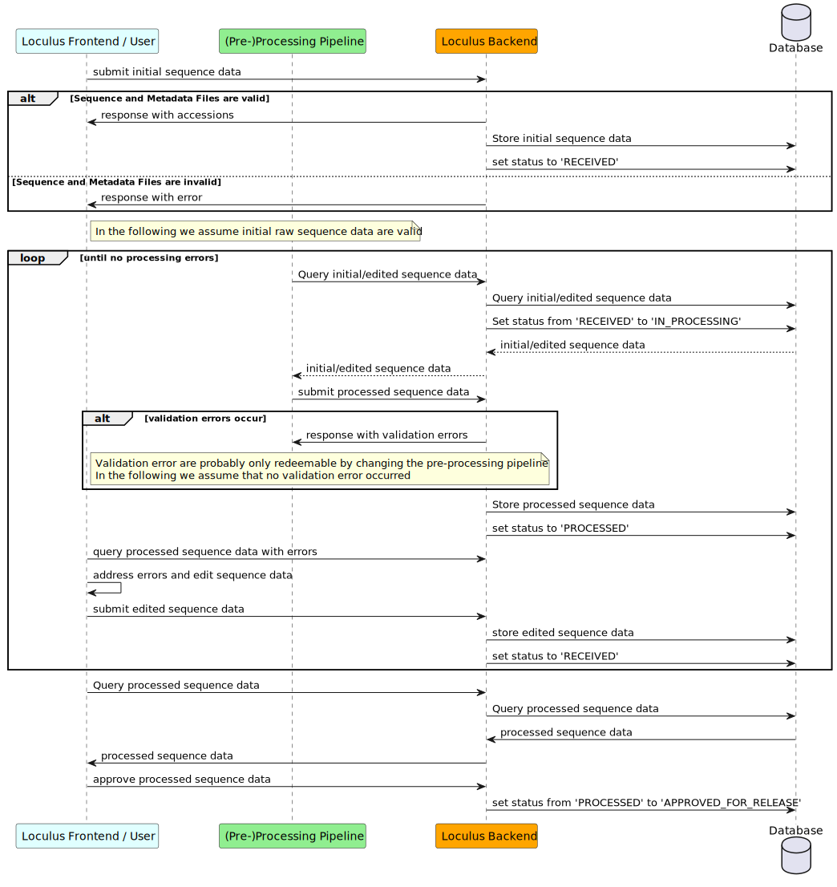
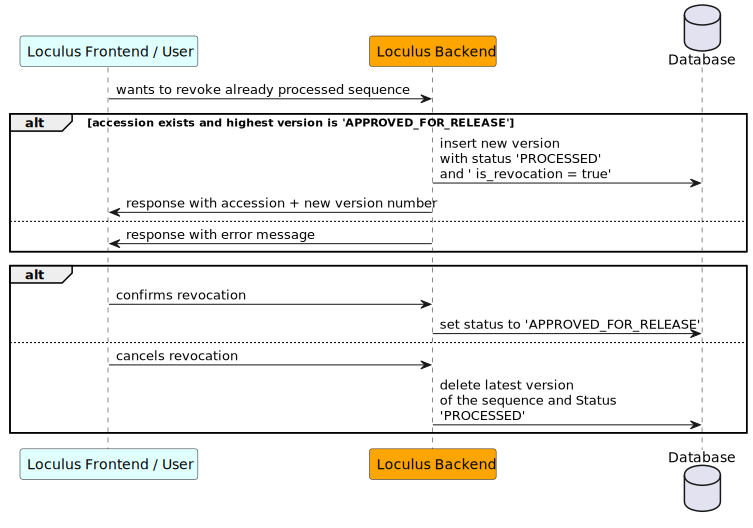

# Runtime View

## Glossary

Extension from [docs/glossary.md](../../docs/glossary.md)

- Unpreprocessed data: the data that the submitter provides
- Preprocessed data: the data that the preprocessing pipeline provides/derives based on the unpreprocessed data
- Revision: a new version of unpreprocessed data associated with an existing accession that is already released
- Revocation: a new version that is associated with an existing accession that is already released and that is marked as revocation. Data are empty.

## Initial submission

To submit new sequences, the user (on behalf of a submitting group) calls the `/submit` endpoint and sends unpreprocessed data.
Data may be compressed using zstd, gzip, bzip2, xz, lzma or zip.
For each sequence, a new row in the "sequenceEntries" table is created.
It generates a new accession. The version number of the sequence entries is 1. The submitter can restrict the usage of the data for a certain time period (at maximum 1 year). The license can be changed by any member of the submitting group. After the restricted period, the license of the data will be changed to open use.

Technically, the upload of data happens in two steps.
The user uploads the data to the backend to persist it.
Additional auxiliary tables are used for validation and processing reasons.
The following diagram shows the sequence of events.

### Preprocessing & Editing

The data will be processed by a preprocessing pipeline (see [preprocessing pipeline specification](../../preprocessing/specification.md)). If the data contain errors, the user has to review the errors and edit the data (sequence data can be downloaded as _fasta_ file to ease editing).

The edited data will be preprocessed again.
If the data do not contain errors, they will be staged unless the user selected the "release directly"-mode.
The user can then edit the data and approve them.
If the "release directly"-mode is used, the staging phase will be skipped and the data directly released.
If the user decides to not approve a sequence entry, the entry will be (permanently) removed from the database.

### Sequence entry statuses

When submitting a sequence entry, it goes through a series of statuses:

**Received**: The sequence entry was received by the backend and awaits preprocessing.

**In_processing**: The sequence entry is being processed by the preprocessing pipeline.

**Has_errors**: The sequence entry contains errors that prevent a release. It must be edited and resubmitted by the submitter.

**Awaiting_approval**:
The sequence entry was successfully processed by the preprocessing pipeline and can be released
or a revocation was submitted.
The submitter has to approve the release.

**Approved_for_release**: The sequence entry was approved for release. It is or will shortly be released.

The following diagram shows the different statuses and their transitions. The **blue-dotted** boxes represent data. The **green-dotted** boxes represent entry creation actions. The **red-dotted** boxes represent entry deletion actions.

## Revision

To revise a sequence entry that has been released (i.e., the status is APPROVED_FOR_RELEASE),
the user calls the `/revise` endpoint and sends accessions and unpreprocessed data.
For each revised sequence entry, the user has to be part of the submitting group for which the entry was initially submitted.
Then a new row in the "sequenceEntries" table is created.
It does not change any existing rows and does not create new accessions.
The new rows have an incremented version number.

The new entry will be treated the same way as a new submission and undergoes the same status transitions (see diagram in the "Initial submission" section).

## Data use terms change

To change the date when restricted-use sequence entries become open, one of the members of the owning submitting group can use the `/data-use-terms` endpoint and sends accessions and a new date when the data become open. The date must be earlier than the current date. For each sequence entry, the user has to be part of the submitting group for which the entry was initially submitted.

Data use terms apply to all versions of one accession and are persisted in an extra table. Each row of the table contains the accession, the date when the data will become open, the user who changed the data use terms and when the change was made. Older entries are superseded by newer entries and function as a history of data use terms changes.

## Revocation

To revoke a sequence entry that has been released (i.e., the status is APPROVED_FOR_RELEASE),
the user calls the `/revoke` endpoint and sends accessions.
For each revoked sequence entry, the user has to be a member of the group for which the entry was initially submitted.
Then a new row in the "sequenceEntries" table is created.
The unpreprocessed data are empty. The "revoked" flag is set to true.
The new rows have an incremented version number (see diagram in the "Initial submission" section).

## Example flow

### Database changes

In following, the changes of the databases are shown given a series of example events.

**Event 1:** The user submits `[{data: d1}, {data: d2}]`.

| accession | version | submitter | submitted_at | started_processing_at | finished_processing_at | approved_at | status   | is_revocation | original_data | processed_data | errors | warnings |
| --------- | ------- | --------- | ------------ | --------------------- | ---------------------- | ----------- | -------- | ------------- | ------------- | -------------- | ------ | -------- |
| 1         | 1       | user1     | t1           |                       |                        |             | RECEIVED | false         | d1            |                |        |          |
| 2         | 1       | user1     | t1           |                       |                        |             | RECEIVED | false         | d2            |                |        |          |

**Event 2:** The preprocessing pipeline processes the two sequence entries and found no errors.

| accession | version | submitter | submitted_at | started_processing_at | finished_processing_at | approved_at | status            | is_revocation | original_data | processed_data | errors | warnings |
| --------- | ------- | --------- | ------------ | --------------------- | ---------------------- | ----------- | ----------------- | ------------- | ------------- | -------------- | ------ | -------- |
| 1         | 1       | user1     | t1           | t2                    | t3                     |             | AWAITING_APPROVAL | false         | d1            | ...            | []     | []       |
| 2         | 1       | user1     | t1           | t2                    | t3                     |             | AWAITING_APPROVAL | false         | d2            | ...            | []     | []       |

**Event 3:** The user approves accession 1 and rejects accession 2.

| accession | version | submitter | submitted_at | started_processing_at | finished_processing_at | approved_at | status               | is_revocation | original_data | processed_data | errors | warnings |
| --------- | ------- | --------- | ------------ | --------------------- | ---------------------- | ----------- | -------------------- | ------------- | ------------- | -------------- | ------ | -------- |
| 1         | 1       | user1     | t1           | t2                    | t3                     | t4          | APPROVED_FOR_RELEASE | false         | d1            | ...            | []     | []       |

**Event 4:** The user revises: `[{accession: 1, data: d3}]`

| accession | version | submitter | submitted_at | started_processing_at | finished_processing_at | approved_at | status               | is_revocation | original_data | processed_data | errors | warnings |
| --------- | ------- | --------- | ------------ | --------------------- | ---------------------- | ----------- | -------------------- | ------------- | ------------- | -------------- | ------ | -------- |
| 1         | 1       | user1     | t1           | t2                    | t3                     | t4          | APPROVED_FOR_RELEASE | false         | d1            | ...            | []     | []       |
| 1         | 2       | user1     | t5           |                       |                        |             | RECEIVED             | false         | d3            |                |        |          |

**Event 5:** The preprocessing pipeline process the sequence entries and found no errors.

| accession | version | submitter | submitted_at | started_processing_at | finished_processing_at | approved_at | status               | is_revocation | original_data | processed_data | errors | warnings |
| --------- | ------- | --------- | ------------ | --------------------- | ---------------------- | ----------- | -------------------- | ------------- | ------------- | -------------- | ------ | -------- |
| 1         | 1       | user1     | t1           | t2                    | t3                     | t4          | APPROVED_FOR_RELEASE | false         | d1            | ...            | []     | []       |
| 1         | 2       | user1     | t5           | t6                    | t7                     |             | AWAITING_APPROVAL    | false         | d3            | ...            | []     | []       |

**Event 6:** The user approves the revision.

| accession | version | submitter | submitted_at | started_processing_at | finished_processing_at | approved_at | status               | is_revocation | original_data | processed_data | errors | warnings |
| --------- | ------- | --------- | ------------ | --------------------- | ---------------------- | ----------- | -------------------- | ------------- | ------------- | -------------- | ------ | -------- |
| 1         | 1       | user1     | t1           | t2                    | t3                     | t4          | APPROVED_FOR_RELEASE | false         | d1            | ...            | []     | []       |
| 1         | 2       | user1     | t5           | t6                    | t7                     | t8          | APPROVED_FOR_RELEASE | false         | d3            | ...            | []     | []       |

**Event 7:** The user revokes accession 1.

| accession | version | submitter | submitted_at | started_processing_at | finished_processing_at | approved_at | status               | is_revocation | original_data | processed_data | errors | warnings |
| --------- | ------- | --------- | ------------ | --------------------- | ---------------------- | ----------- | -------------------- | ------------- | ------------- | -------------- | ------ | -------- |
| 1         | 1       | user1     | t1           | t2                    | t3                     | t4          | APPROVED_FOR_RELEASE | false         | d1            | ...            | []     | []       |
| 1         | 2       | user1     | t5           | t6                    | t7                     | t8          | APPROVED_FOR_RELEASE | false         | d3            | ...            | []     | []       |
| 1         | 3       | user1     | t9           |                       |                        |             | AWAITING_APPROVAL    | true          |               |                |        |          |

**Event 8:** The user rejects the revocation of accession 1.

| accession | version | submitter | submitted_at | started_processing_at | finished_processing_at | approved_at | status               | is_revocation | original_data | processed_data | errors | warnings |
| --------- | ------- | --------- | ------------ | --------------------- | ---------------------- | ----------- | -------------------- | ------------- | ------------- | -------------- | ------ | -------- |
| 1         | 1       | user1     | t1           | t2                    | t3                     | t4          | APPROVED_FOR_RELEASE | false         | d1            | ...            | []     | []       |
| 1         | 2       | user1     | t5           | t6                    | t7                     | t8          | APPROVED_FOR_RELEASE | false         | d3            | ...            | []     | []       |

**Event 9:** The user revokes accession 1 again.

| accession | version | submitter | submitted_at | started_processing_at | finished_processing_at | approved_at | status               | is_revocation | original_data | processed_data | errors | warnings |
| --------- | ------- | --------- | ------------ | --------------------- | ---------------------- | ----------- | -------------------- | ------------- | ------------- | -------------- | ------ | -------- |
| 1         | 1       | user1     | t1           | t2                    | t3                     | t4          | APPROVED_FOR_RELEASE | false         | d1            | ...            | []     | []       |
| 1         | 2       | user1     | t5           | t6                    | t7                     | t8          | APPROVED_FOR_RELEASE | false         | d3            | ...            | []     | []       |
| 1         | 3       | user1     | t10          |                       |                        |             | AWAITING_APPROVAL    | true          |               |                |        |          |

**Event 10:** The user approves the revocation.

| accession | version | submitter | submitted_at | started_processing_at | finished_processing_at | approved_at | status               | is_revocation | original_data | processed_data | errors | warnings |
| --------- | ------- | --------- | ------------ | --------------------- | ---------------------- | ----------- | -------------------- | ------------- | ------------- | -------------- | ------ | -------- |
| 1         | 1       | user1     | t1           | t2                    | t3                     | t4          | APPROVED_FOR_RELEASE | false         | d1            | ...            | []     | []       |
| 1         | 2       | user1     | t5           | t6                    | t7                     | t8          | APPROVED_FOR_RELEASE | false         | d3            | ...            | []     | []       |
| 1         | 3       | user1     | t10          |                       |                        | t11         | APPROVED_FOR_RELEASE | true          |               |                |        |          |

## Sequence diagrams

In following, there are sequence diagrams of the work-flow for the initial submission, revision and revocation process. Without loss of generality we depict the work-flow using the frontend as the user interface. However, the work-flow is the same if the user uses the API directly.

### Initial submission

### Revision

### Revocation

## Updating metadata fields from an external source

If you have metadata fields that are (typically) not added by the user but updated via an external source at a later time we recommend using the `update-external-metadata` fields endpoint. A common example of this is submission of sequences in loculus to INSDC. After sequences are released in loculus they will also be uploaded to INSDC. This is done after the sequences are uploaded by a user and therefore at the time of upload certain INSDC-related metadata fields will be unknown. These can then be added at a later date without causing a version increase (as the sequence has not been updated). Only sequences that are `'APPROVED_FOR_RELEASE'` can be updated and the `externalMetadata` field must be defined in the `backend_config.json`. Furthermore, the endpoint can only be used by users with correct authorization, i.e. in the `external_metadata_updater` group.
