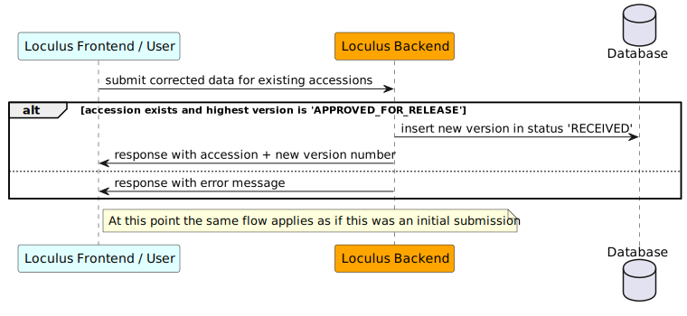

# Runtime View

## Glossary

- Sequence ID: a sequence-specific identifier that Pathoplexus assigns
- Version: the version number of a sequence+metadata
- Unpreprocessed data: the data that the submitter provides
- Preprocessed data: the data that the preprocessing pipeline provides/derives based on the unpreprocesed data
- Revision: a new version of unpreprocessed data associated with an existing sequence ID that is already released
- Revocation: a new version that is associated with an existing sequence ID that is already released and that is marked as revocation. Data are empty.

## Initial submission

To submit new sequences, the user calls the `/submit` endpoint and sends unpreprocessed data. For each sequence, Pathoplexus creates a new row in the "sequences" table. It generates a new sequence ID. The version number of the sequences is 1.

### Preprocessing & Review
The data will be processed by a preprocessing pipeline (see [preprocessing pipeline specification](../../preprocessing/specification.md)). If the data contain errors, the user has to review the errors and edit the data (sequence data can be downloaded as _fasta_ file to ease reviewing).

The reviewed data will be preprocessed again. If the data do not contain errors, they will be staged unless the user selected the "release directly"-mode. The user can then review the data and approve them. If the "release directly"-mode is used, the staging phase will be skipped and the data directly released. If the user decides to not approve a sequence, the entry will be (permanently) removed from the database.

The following diagram shows the different statuses and their transitions. The **blue-dotted** boxes represent data. The **green-dotted** boxes represent entry creation actions. The **red-dotted** boxes represent entry deletion actions.

## Revision

To revise a sequence that has been released (i.e., the status is APPROVED_FOR_RELEASE), the user calls the `/revise` endpoint and sends sequence IDs and unpreprocessed data. For each revised sequence, Pathoplexus creates a new row in the "sequences" table. It does not change any existing rows and does not create new sequence IDs. The new rows have an incremented version number.

The new entry will be treated the same way as a new submission and undergoes the same status transitions (see diagram in the "Initial submission" section).

## Revocation

To revoke a sequence that has been released (i.e., the status is APPROVED_FOR_RELEASE), the user calls the `/revoke` endpoint and sends sequence IDs. For each revoked sequence, Pathoplexus creates a new row in the "sequences" table. The unpreprocessed data are empty. The "revoked" flag is set to true. The new rows have an incremented version number  (see diagram in the "Initial submission" section).

## Example flow

### Database changes
In following, the changes of the databases are shown given a series of example events.

**Event 1:** The user submits `[{data: d1}, {data: d2}]`.

| sequence_id | version | submitter | submitted_at | started_processing_at | finished_processing_at | approved_at | status   | is_revocation | original_data | processed_data | errors | warnings |
| ----------- |---------|-----------| ------------ |-----------------------| ---------------------- | ----------- | -------- |---------------| ------------- | -------------- | ------ | -------- |
| 1           | 1       | user1     | t1           |                       |                        |             | RECEIVED | false         | d1            |                |        |          |
| 2           | 1       | user1     | t1           |                       |                        |             | RECEIVED | false         | d2            |                |        |          |

**Event 2:** The preprocessing pipeline processes the two sequences and found no errors.

| sequence_id | version | submitter | submitted_at | started_processing_at | finished_processing_at | approved_at | status  | is_revocation | original_data | processed_data | errors | warnings |
| ----------- | -------- |-----------| ------------ | --------------------- | ---------------------- | ----------- | ------- |---------------| ------------- | -------------- | ------ | -------- |
| 1           | 1        | user1     | t1           | t2                    | t3                     |             | STAGING | false         | d1            | ...            | []     | []       |
| 2           | 1        | user1     | t1           | t2                    | t3                     |             | STAGING | false         | d2            | ...            | []     | []       |

**Event 3:** The user approves sequence 1 and rejects sequence 2.

| sequence_id | version | submitter | submitted_at | started_processing_at | finished_processing_at | approved_at | status     | is_revocation | original_data | processed_data | errors | warnings |
| ----------- | -------- | --------- | ------------ | --------------------- | ---------------------- | ----------- | ---------- |---------------| ------------- | -------------- | ------ | -------- |
| 1           | 1        | user1     | t1           | t2                    | t3                     | t4          | APPROVED_FOR_RELEASE | false         | d1            | ...            | []     | []       |

**Event 4:** The user revises: `[{sequenceId: 1, data: d3}]`

| sequence_id | version | submitter | submitted_at | started_processing_at | finished_processing_at | approved_at | status     | is_revocation | original_data | processed_data | errors | warnings |
| ----------- | -------- | --------- | ------------ | --------------------- | ---------------------- | ----------- | ---------- |---------------| ------------- | -------------- | ------ | -------- |
| 1           | 1        | user1     | t1           | t2                    | t3                     | t4          | APPROVED_FOR_RELEASE | false         | d1            | ...            | []     | []       |
| 1           | 2        | user1     | t5           |                       |                        |             | RECEIVED   | false         | d3            |                |        |          |

**Event 5:** The preprocessing pipeline process the sequence and found no errors.

| sequence_id | version | submitter | submitted_at | started_processing_at | finished_processing_at | approved_at | status     | is_revocation | original_data | processed_data | errors | warnings |
| ----------- | -------- | --------- | ------------ | --------------------- | ---------------------- | ----------- | ---------- |---------------| ------------- | -------------- | ------ | -------- |
| 1           | 1        | user1     | t1           | t2                    | t3                     | t4          | APPROVED_FOR_RELEASE | false         | d1            | ...            | []     | []       |
| 1           | 2        | user1     | t5           | t6                    | t7                     |             | STAGING    | false         | d3            | ...            | []     | []       |

**Event 6:** The user approves the revision.

| sequence_id | version | submitter | submitted_at | started_processing_at | finished_processing_at | approved_at | status     | is_revocation | original_data | processed_data | errors | warnings |
| ----------- | -------- | --------- | ------------ | --------------------- | ---------------------- | ----------- | ---------- |---------------| ------------- | -------------- | ------ | -------- |
| 1           | 1        | user1     | t1           | t2                    | t3                     | t4          | APPROVED_FOR_RELEASE | false         | d1            | ...            | []     | []       |
| 1           | 2        | user1     | t5           | t6                    | t7                     | t8          | APPROVED_FOR_RELEASE | false         | d3            | ...            | []     | []       |

**Event 7:** The user revokes sequence 1.

| sequence_id | version | submitter | submitted_at | started_processing_at | finished_processing_at | approved_at | status          | is_revocation | original_data | processed_data | errors | warnings |
| ----------- | -------- | --------- | ------------ | --------------------- | ---------------------- | ----------- | --------------- |---------------| ------------- | -------------- | ------ | -------- |
| 1           | 1        | user1     | t1           | t2                    | t3                     | t4          | APPROVED_FOR_RELEASE      | false         | d1            | ...            | []     | []       |
| 1           | 2        | user1     | t5           | t6                    | t7                     | t8          | APPROVED_FOR_RELEASE      | false         | d3            | ...            | []     | []       |
| 1           | 3        | usre1     | t9           |                       |                        |             | AWAITING_APPROVAL_FOR_REVOCATION | true          |               |                |        |          |

**Event 8:** The user rejects the revocation of sequence 1.

| sequence_id | version | submitter | submitted_at | started_processing_at | finished_processing_at | approved_at | status     | is_revocation | original_data | processed_data | errors | warnings |
| ----------- | -------- | --------- | ------------ | --------------------- | ---------------------- | ----------- | ---------- |---------------| ------------- | -------------- | ------ | -------- |
| 1           | 1        | user1     | t1           | t2                    | t3                     | t4          | APPROVED_FOR_RELEASE | false         | d1            | ...            | []     | []       |
| 1           | 2        | user1     | t5           | t6                    | t7                     | t8          | APPROVED_FOR_RELEASE | false         | d3            | ...            | []     | []       |

**Event 9:** The user revokes sequence 1 again.

| sequence_id | version | submitter | submitted_at | started_processing_at | finished_processing_at | approved_at | status          | is_revocation | original_data | processed_data | errors | warnings |
| ----------- | -------- | --------- | ------------ | --------------------- | ---------------------- | ----------- | --------------- |---------------| ------------- | -------------- | ------ | -------- |
| 1           | 1        | user1     | t1           | t2                    | t3                     | t4          | APPROVED_FOR_RELEASE      | false         | d1            | ...            | []     | []       |
| 1           | 2        | user1     | t5           | t6                    | t7                     | t8          | APPROVED_FOR_RELEASE      | false         | d3            | ...            | []     | []       |
| 1           | 3        | usre1     | t10           |                       |                        |             | AWAITING_APPROVAL_FOR_REVOCATION | true          |               |                |        |          |

**Event 10:** The user approves the revocation.

| sequence_id | version | submitter | submitted_at | started_processing_at | finished_processing_at | approved_at | status     | is_revocation | original_data | processed_data | errors | warnings |
| ----------- | -------- | --------- | ------------ | --------------------- | ---------------------- | ----------- | ---------- |---------------| ------------- | -------------- | ------ | -------- |
| 1           | 1        | user1     | t1           | t2                    | t3                     | t4          | APPROVED_FOR_RELEASE | false         | d1            | ...            | []     | []       |
| 1           | 2        | user1     | t5           | t6                    | t7                     | t8          | APPROVED_FOR_RELEASE | false         | d3            | ...            | []     | []       |
| 1           | 3        | usre1     | t10          |                       |                        | t11         | APPROVED_FOR_RELEASE | true          |               |                |        |          |

## Sequence diagrams

In following, there are sequence diagrams of the work-flow for the initial submission, revision and revocation process. Without loss of generality we depict the work-flow using the frontend as the user interface. However, the work-flow is the same if the user uses the API directly. 

### Initial submission

### Revision

### Revocation

