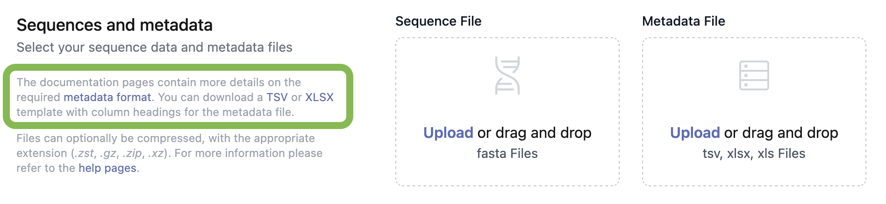

You can only upload sequences if you already have an account and [are part of a submitting group](../create-manage-groups/).

Before you begin this process, you should ensure your data is in the correct format. Each sequence should have a unique submissionID that can be used to associate it with its corresponding metadata entry.

Loculus expects:

-   Sequence data in `fasta` format with a unique submissionID per sequence.
-   Metadata in `tsv` format for each sequence.If you need help formatting metadata, there is a metadata template for each organism on the submission page.

## Multi-segmented Pathogens

Loculus expects multi-segmented pathogens to have one unique submissionID per **isolate** (pathogen sample containing all segments). However, `fasta` files should still have a separate entry/record per segment. Therefore, each record id should include the unique submissionID of the isolate and the segment name, for example: `submissionID + '_' + segmentName`. The metadata is uploaded per isolate, i.e. there will be only one row for each `submissionID` and segmented metadata parameters need to be uploaded individually, i.e. under `length_{segmentName}` etc.

## Website

Uploading sequences via the website is a easy way to submit sequences without having to worry about any code.

1. Log into your account, and then click 'Submit' in the top-right corner of the website
2. Select the organism that you'd like to submit sequences for
3. Drag-and-drop a `fasta` file with the sequences and a metadata file with the associated metadata into the box on the website, or click the 'Upload a file' link within the boxes to open a file-selection box
4. Select the Terms of Use that you would like for your data
5. Select 'Submit sequences' at the bottom of the page

The data will now be processed, and you will have to approve your submission before it is finalized. You can see how to do this [here](../approve-submissions/).

## API

_Instructions coming soon_
