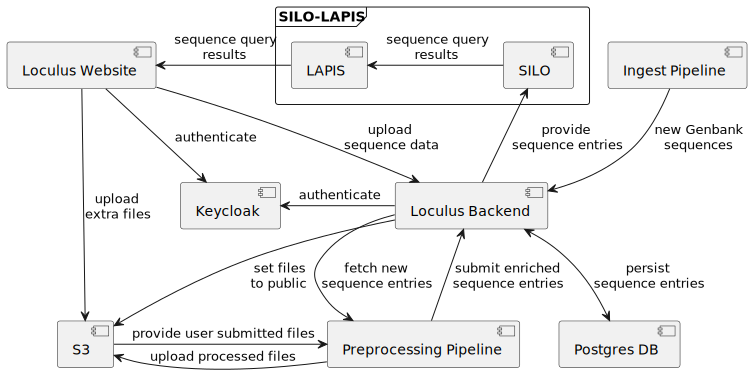

Below, we provide an overview of the components of Loculus. This is in particular important if you would like to set up an own instance or join the development team but also useful if you would like to interact with a Loculus instance through an API.

Loculus has a modular architecture and consists of several sub-services:

-   **Backend server:** The backend is the central service of Loculus and most other services interact with it. It manages all persistent data (such as the sequence entries and submitting groups) except the data for user authentication which are managed by Keycloak.
-   **Backend database:** The backend server stores all the data in a PostgreSQL database and it is the only service that has direct access to this database.
-   **Keycloak:** Loculus uses the open-source software [Keycloak](https://github.com/keycloak/keycloak) for identity and access management which supports features such as password reset and two-factor authentication. Each Loculus instance includes a Keycloak instance. (Note: Keycloak is a local/on-premise software, data are not sent to any cloud service!)
-   **Keycloak database:** Keycloak also uses a PostgreSQL database to store its data (this may be hosted by the same PostgreSQL server as the backend database).
-   **SILO(s):** [SILO](https://github.com/GenSpectrum/LAPIS-SILO) is an open-source query engine for genetic sequences optimized for high performance and supporting alignment-specific queries such as mutation searches. It regularly pulls data from the backend server and indexes them. By default, SILO is not exposed to the users but accessed via LAPIS. For each [organism](../glossary#organism) of a Loculus [instance](../glossary#instance), there is a separate instance of SILO.
-   **LAPIS(es):** [LAPIS](https://github.com/GenSpectrum/LAPIS) provides a convenient interface to SILO, offering a lightweight web API and additional data and compression formats. For each SILO instance, there is a corresponding LAPIS instance.
-   **Website:** The frontend application of Loculus accesses the APIs of the backend server and LAPIS. It uses the backend server for everything related to data submission and LAPIS for searching and downloading released data. For logins and registrations, users are redirected to Keycloak.
-   **Preprocessing pipeline(s):** A preprocessing pipeline fetches [unprocessed/user-submitted data](../glossary#unprocessed-data) from the backend server, processes them (which usually includes cleaning, alignment and adding annotations), and sends [processed data](../glossary#processed-data) back to the backend server. The pipeline contains [organism](../glossary#organism)-specific logic, thus, there is a separate pipeline for each organism. We maintain a customizeable preprocessing pipeline that uses [Nextclade](https://github.com/nextstrain/nextclade) for alignment, quality checks and annotations but it is easy to write a new one by following the [preprocessing pipeline specifications](https://github.com/loculus-project/loculus/blob/main/preprocessing/specification.md).

## Motivation

Why did we choose this (rather complex) architecture? Here are some of the key advantages:

-   **Performant query engine and existing API:** By using LAPIS and SILO (which were originally developed for [CoV-Spectrum](https://cov-spectrum.org)), Loculus reuses a query engine that has proven to be able to handle datasets with millions of viral sequences and offers a simple and flexible API.
-   **Pathogen agnostic:** By keeping the preprocessing pipeline separate from the backend server, it is very simple to develop new and pathogen-specific pipelines. The pipelines do not need to be written in the same programming language as the backend but it is possible to use any language and framework and call existing tools.
-   **Secure and convenient authentication:** By using Keycloak, Loculus offers a secure authentication system with support for two-factor authentication and social identity providers such as ORCID. It is also possible to connect it with LDAP or Active Directory servers which might be useful for institution-internal systems.
-   **Easy to back up:** Despite having many sub-services, it is simple to create backups because many services do not persist own data. All data are stored in only two PostgreSQL databases: the backend database and the Keycloak database.
