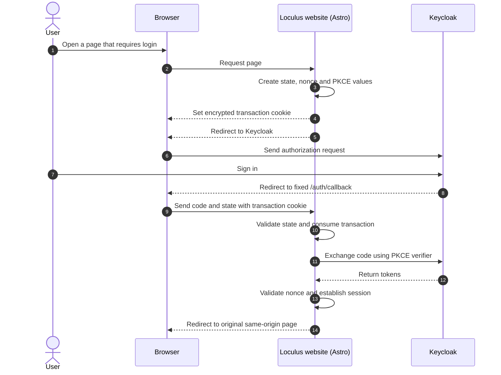

Loculus uses [Keycloak](https://www.keycloak.org/) as its OpenID Connect (OIDC) provider. Keycloak authenticates the user, while the Loculus website starts the login transaction, validates the response and establishes the website session.

This page describes browser login. [Authentication via the API](../../for-users/authenticate-via-api/) follows a separate flow.

## Login flow

The browser is redirected to Keycloak to enter credentials. Keycloak then returns an authorization code to the fixed `/auth/callback` endpoint on the Loculus website. Astro processes that callback on the server before the final page is rendered.

When `/auth/login` receives the requested destination as `returnTo`, it checks that the destination has the same origin as the website before redirecting the browser to Keycloak. After a successful callback, the website redirects the user to that stored destination. This prevents a crafted login link from sending the user to an external site after login.

## Security values

- **State** is a random, single-use value that links the callback to the browser that started the login. It protects the login flow against cross-site request forgery.
- **Nonce** is a random value included in the authentication request and checked in the returned identity token. It prevents a response from another login transaction from being accepted.
- **PKCE** creates a one-time secret verifier and sends only its derived challenge with the initial request. Requiring the verifier when the website exchanges the authorization code means that an intercepted code is not sufficient to complete the login, even independently of the client secret.

These values protect different parts of the same flow: `state` checks the browser round trip, PKCE protects the authorization-code exchange, and `nonce` checks the resulting identity token.

Loculus stores these values, together with `returnTo`, in an authenticated and encrypted HTTP-only cookie. The cookie:

- is valid for one hour, accommodating registration, email verification and multi-factor authentication;
- is sent only over HTTPS, except in explicitly configured local development environments;
- uses `SameSite=Lax`;
- can hold up to three concurrent login transactions; and
- consumes the selected transaction when its callback is received.

The transaction cookie does not contain the user's password or access token.

## Callback validation failures

When the middleware cannot complete the transaction, `/auth/callback` redirects to a login-failure page without creating a session. Removing the callback parameters from the visible URL also prevents an invalid authorization code and `state` from remaining in the address bar. Common causes include:

- the login was started more than one hour earlier;
- the callback was refreshed or reused after its transaction had already been consumed;
- the transaction cookie is missing or cannot be decrypted; or
- OIDC validation or retrieval of the user's information failed.

Use **Try logging in again** on the failure page instead of refreshing or reopening a failed callback URL. This starts a new OIDC transaction and returns to the account page after a successful login. Server logs record a non-secret transaction identifier and one of the following reasons:

- `missing_or_expired_transaction`
- `provider_error`
- `validation_failed`
- `userinfo_failed`

The transaction identifier is a truncated hash of `state`; the raw `state`, authorization code and tokens are not logged.
