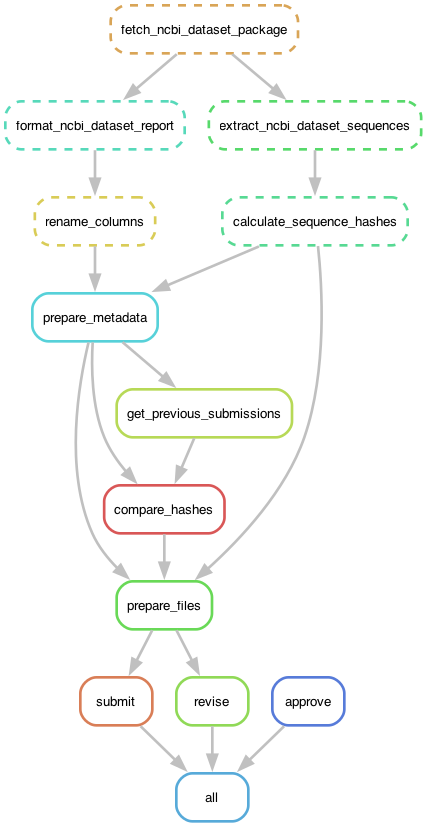
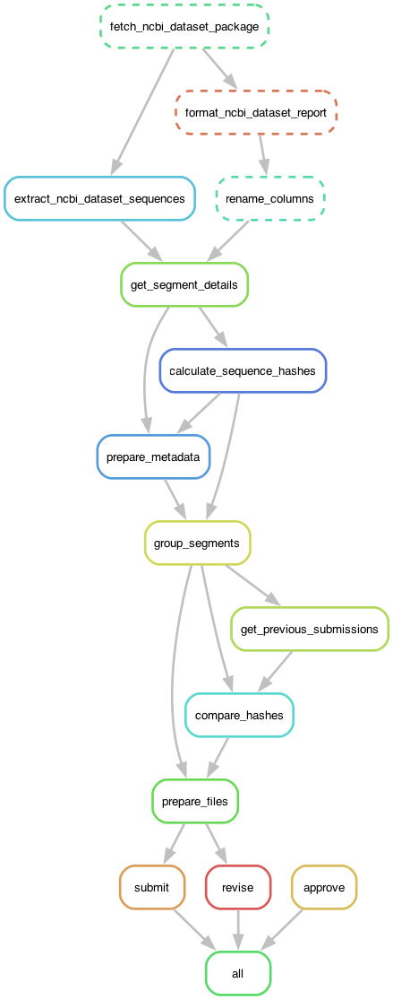

# Pipeline to ingest data from INSDC into loculus

## Overview

The following is a rough overview of the pipeline's steps.

The snakemake DAG can be visualized using [graphviz](https://en.wikipedia.org/wiki/Graphviz):

```bash
snakemake --dag | dot -Tpng > static/dag.png
```





### Download data from NCBI virus

Using NCBI `datasets` CLI, download all sequences and corresponding NCBI curated metadata for a configurable taxon. The taxon is specified using the NCBI Taxonomy ID, and includes all child taxa, i.e. dowloading sequences for the Ebola virus taxon ID includes all sequences for more specific Ebola virus (sub)species taxon ids.

Sequences and metadata are transformed into (nd)json files to simplify (de)serialization and further processing.

### Segmented viruses

NCBI handles segmented viruses differently than Loculus. In NCBI, the primary level of accession is per segment of a genomic sequence, with each segment having its own metadata. In Loculus a sample is uploaded with all its segments grouped under a collective accession ID, and metadata applies at the sample (or group) level. FASTA files when downloaded have each segment headed under `>[accessionID]_[segmentName]`. (When uploaded to Loculus they need be headed as `>[submissionID]_[segmentName]`)

The segment a sample corresponds to can only be determined from the descriptions of a sequence fasta record. In `get_segment_details.py` we discard all sequences with unclear segment annotations and add `segment` as a metadata field. (TODO #2079: Use nextclade instead of a regex search to determine which segment the sequence aligns with best to keep as much data as possible).

### Transforming values to conform with Loculus' expectations

Metadata as received from `datasets` is transformed to conform to Loculus' expectations. This includes for example:

- renaming fields
- transforming values, e.g. turn author strings from `LastName1, Initial1, LastName2, Initial2` into `Initial1 LastName1, Initial2 LastName2`
- splitting fields, e.g. NCBI's single, complex collection country field (`Germany: Munich, Bavaria`) is split into multiple fields `country`, `state`, `division` (`Germany`, `Bavaria`, `Munich`)

Note that the `submissionId` is just the `genbank_accession` for non-segmented viruses, but the concatenation of the `genbank_accession` of each segment (with the appended segment name for each segment) for segmented viruses.

### Calculating a hash for each sequence entry

Every sequence entry is to be uploaded only once and must be ignored by future periodic ingest runs unless the metadata and/or sequence has changed.

To achieve this, an md5 hash is generated for each sequence entry based on the post-transform metadata and sequence content. The hash is based on all metadata fields submitted to Loculus as well as the sequence. Hence, changes to the ingest pipeline's transform step (above) can lead to changes in hash and resubmission - even without underlying data change on INSDC. Likewise, some changes to the INSDC data might not cause a sequence update on Loculus if what has been changed does not affect the post-transformed metadata.

For segmented viruses we calculate the md5 hash of each segment and then, after grouping segments we concatenate the hashes of each segment before again hashing the hashes.

### Grouping segmented viruses

In NCBI sequences are uploaded for each segment separately. To upload all segments from the same isolate we need to group the sequences. We do this by grouping NCBI segments based on `ncbi_isolate_name` and other isolate-specific attributes. Segments will only be uploaded together if all these parameters match. We also add additional checks to prevent multiple sequences of the same segment being grouped together. If a check fails, or the segments do not have isolate information, the segments will be ingested and uploaded to Loculus individually.

We group segments by adding a `joint_accession` field to the metadata which consists of a concatenated list of all `genbank_accession` IDs of the segments in the group. Each fasta record is also modified to use `joint_accession` with the concatenated segment as their ID (as required by loculus).

### Getting status and hashes of previously submitted sequences and triaging

Before uploading new sequences, the pipeline queries the Loculus backend for the status and hash of all previously submitted sequences. This is done to avoid uploading sequences that have already been submitted and have not changed. Furthermore, only accessions whose highest version is in status `APPROVED_FOR_RELEASE` can be updated through revision. Entries in other states cannot currently be updated (TODO: Potentially use `/submit-edited-data` endpoint to allow updating entries in more states).

Hashes and statuses are used to triage sequences into 4 categories which determine the action to be taken:

- `submit`: Sequences that have not been submitted before
- `revise`: Sequences that have been submitted before and have changed
- `no_change`: Sequences that have been submitted before and have not changed
- `blocked`: Sequences that have been submitted before but are not in a state that allows updating

### Uploading sequences to Loculus

Depending on the triage category, sequences are either submitted as new entries or revised.

### Approving sequences in status `WAITING_FOR_APPROVAL`

Due to the current Loculus backend design, sequences that are submitted as new entries or revised are not automatically approved for release. Instead, they are put into status `WAITING_FOR_APPROVAL` and must be approved manually through the Loculus backend.

The `ingest` pipeline handles this step by continuously polling the Loculus backend for sequences in status `WAITING_FOR_APPROVAL` and approving them.

### Points of contact with other components

The pipeline interacts with the following components:

- Loculus:
  - Authentication: Get jw token to access the Loculus backend
  - Loculus backend: Submit sequences and get status and hashes of previously submitted sequences
- NCBI:
  - NCBI server queried by `datasets` CLI : Download sequences and metadata

Indirect requirements:

- Preprocessing: Without preprocessing running, ingest is not able to approve anything, as sequences will be stuck in the backend.

## Deployment

The pipeline runs twice in different kubernetes resources:

- An "approve" deployment that continuously polls the Loculus backend for sequences in status `WAITING_FOR_APPROVAL` and approves them, one replica with kubernetes resource type apps/v1/Deployment.
- An "ingest" cronjob batch/v1/CronJob that runs the ingest pipeline regularly

In production the ingest pipeline runs in a docker container that takes a config file as input.

We use the Snakemake workflow management system which also uses different config files:

- `profiles/default/config.yaml` sets default command line options while running Snakemake.
- `config/config.yaml` and `config/defaults.yaml` turn into a config dict in the `Snakefile` (attributes defined in this file become global variables in the `Snakefile`). The `config/config.yaml` file used in production is generated by the `kubernetes/loculus/templates/loculus-preprocessing-config.yaml`.

TLDR: The `Snakefile` contains workflows defined as rules with required input and expected output files. By default Snakemake takes the first rule as the target one and then constructs a graph of dependencies (a DAG) required to produce the expected output of the first rule. The target rule can be specified using `snakemake {rule}`

## Local Development

Install micromamba, if you are on a mac:

```bash
brew install micromamba
```

Then configure micromamba

```bash
micromamba shell init --shell zsh --root-prefix=~/micromamba
source ~/.zshrc
```

Then activate the loculus-ingest environment

```bash
micromamba create -f environment.yml --platform osx-64 --rc-file .mambarc
micromamba activate loculus-ingest
```

From the ingest directly, create local test configs for the organism you are interested in and copy those configs to your config folder.

```bash
../generate_local_test_config.sh
cp ../temp/ingest-config.{organism}.yaml config/config.yaml
```

Then run snakemake using `snakemake` or `snakemake {rule}`.

Note that by default the pipeline will submit sequences to main. If you want to change this to another branch (that has a preview tag) you can modify the `backend_url` and `keycloak_token_url` arguments in the `config.yaml` file. They are of the form `https://backend-{branch_name}.loculus.org/` and `https://authentication-{branch_name}.loculus.org`. Alternatively, if you are running the backend locally you can also specify the local backend port: `http://localhost:8079` and the local keyclock port: `http://localhost:8083`.

The ingest pipeline requires config files, found in the directory `config`. The `default.yaml` contains default values which will be overridden by the `config.yaml`. To produce the `config.yaml` used in production you can run `../generate_local_test_config.sh` and then copy the configs from the pathogen to the `config.yaml`.

## Testing

Currently, there is not automated testing other than running the pipeline manually and in preview deployments.

## Roadmap

### Automated testing

We should add automated integration tests:

- Set up deployment with backend (including database), keycloak, and preprocessing
- Feed mocked `datasets` output into the pipeline, covering various scenarios
- Check that backend ends up in the expected state

To be able to run tests independently, we should use UUIDs for mock data. Currently, clearing the database is not possible without redeploying everything (see <https://github.com/loculus-project/loculus/issues/1764>).

One complication for testing is that we don't have ARM containers for the backend yet (see <https://github.com/loculus-project/loculus/issues/1765>).

### Recover from processing errors

At some point we should be able to recover from processing errors by using `/submit-edited-data` to update entries in more states than just `APPROVED_FOR_RELEASE`.
